# Markout Analysis — Hyperliquid Wallets (BTC / ETH / SOL / HYPE)

Post-fill markout study of Hyperliquid taker wallets. We measure per-entry markout across five horizons and four coins, rank wallets by markout, test whether top-ranked wallets persist out-of-sample, and characterize the subset that does. Every out-of-sample number below is chronologically split (train → embargo → test), and figures are entry-weighted unless labeled otherwise.

## Summary of findings

1. **Markout term structure is small and coin-shaped.** Field markout is within ±1 bp at 1–4h for BTC/ETH/SOL and bleeds to −6 to −8 bp by 24h. HYPE is the exception — a positive hump peaking ~+3 bp at 8h — but that hump is almost entirely coin drift (neutralized HYPE 24h is −18.6 bp vs raw +2.8 bp).
2. **Top in-sample markout wallets look excellent** (+40 to +130 bp gross at 8h, 60–76% hit rates) **and do not persist out-of-sample.** Train→test rank-IC is +0.017 (p=0.59); selecting on best in-sample markout returns **−28.7 bp net OOS** (winner's curse). This holds across every ranking metric we tried (Sharpe, Sortino, t-stat, shrinkage, PnL, hit-rate, …).
3. **A weak-but-real ranking signal survives** at the population/decile level (monthly rank-IC +0.093 at 8h, 10/10 folds; top-decile forward +4.5 bp over field) — but it is **generic short-horizon reversal**, not wallet skill: the top decile's entire edge is captured by a costless mechanical fade (alpha over fade = +1.0 bp, p=0.44).
4. **The wallets that rank consistently are contrarian faders.** We isolate a frozen 121-wallet recurring cohort; 83% are net faders and they enter hard *against* large, decelerating moves at deep pullbacks. Their edge is the fade, done harder — not private information. Adding wallet identity/direction to a market-state model improves 8h-return prediction by **−0.0003 IC** (i.e., nothing).

---

## 1. Data & universe

- **Raw universe:** 7,332,013 taker entries from **32,949 wallets** across 273 coins, 2025-08-01 → 2026-06-30 (UTC). Per coin: BTC 2.13M entries / 27.1k wallets, ETH 1.04M / 24.1k, SOL 790k / 22.0k, HYPE 771k / 19.9k.
- **Analysis cohort:** to study *copyable* behavior we freeze a mid-frequency taker cohort — wallets with ≥200 majors fills, taker-share ≥ 0.70, median hold 1–24h, and ≥200 training decisions. This yields **1,694 wallets / 812,616 priced entries** on the four majors.
- **Splits (chronological):** TRAIN < 2026-02-01 (583,032 entries) · EMBARGO Feb-2026 (61,116, discarded) · TEST 2026-03-01 → 06-30 (168,468). The test window is a −10.85% BTC down-market.
- **Markout definition:** `raw_Xh = dir · (px(entry + X) / px_entry − 1) · 1e4` (bp). Positive = price moved in the trade's direction after the fill. Horizons: 1h / 2h / 4h / 8h / 24h. Every trade is evaluated as if exited at the horizon, so the horizon markout *is* the trade's PnL.

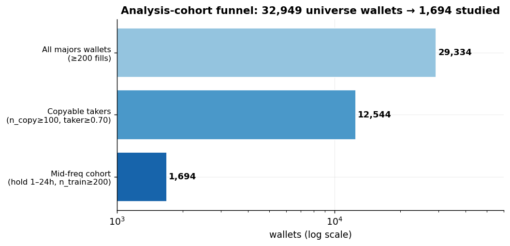

## 2. Wallet EDA

The cohort is long-biased (63% of entries long, rising to 73% in HYPE), trades a median ~$4k ticket with a heavy right tail past $1M, holds a median ~2h round-trip, and is active a median 97 of ~330 days. Entry volume shifts toward BTC over the window (BTC's monthly entry share rises from 25% in Aug to a 55% peak in Apr, easing to 47% by Jun) while the overall tape thins — worth remembering when comparing early vs late months.

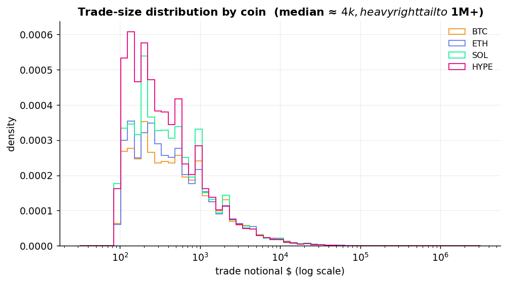

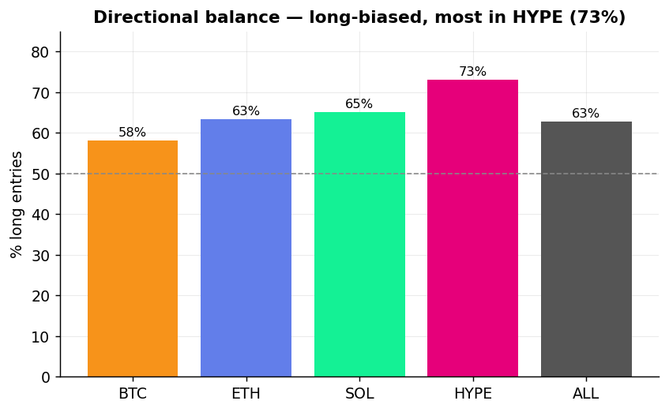 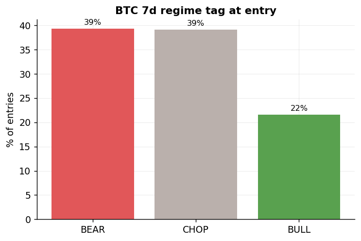

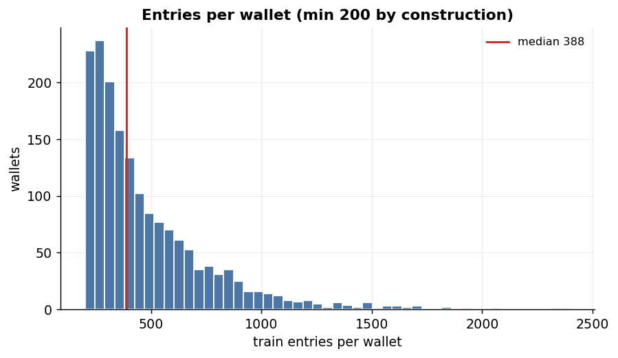 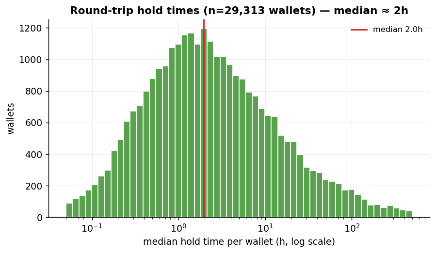

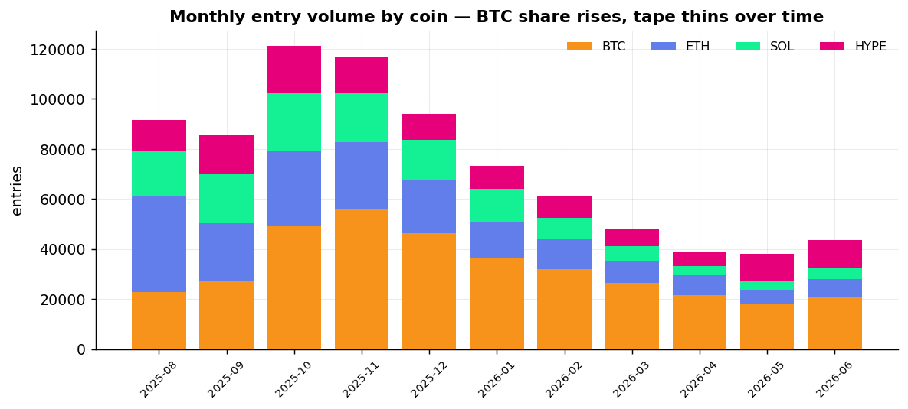

*Hold time is real round-trip data (29,334 wallets); trades are otherwise evaluated at the fixed markout horizon. Max-drawdown, where shown later, is computed on a non-overlapping (≥horizon-spaced) entry subset — a drawdown on the raw overlapping-horizon series is invalid (it scales with trade cadence, not risk).*

## 3. Markout term structure per coin per horizon

Entry-weighted field markout, full sample. BTC bleeds monotonically negative; ETH is flat through 4h then drops at 24h; SOL turns mildly positive at 4–8h before bleeding; **HYPE is the only clear positive hump, peaking ~+3 bp at 8h.** Dispersion grows with horizon (std 93 → 363 bp pooled; HYPE widest at every horizon) — the means are an order of magnitude smaller than the noise.

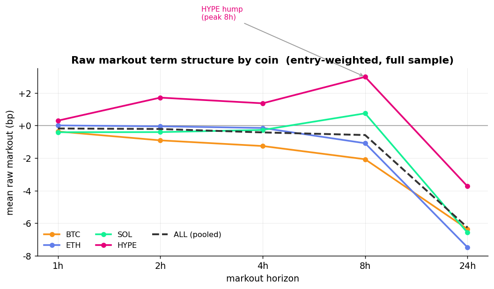

The HYPE hump is **coin drift, not skill.** Stripping each coin's own monthly forward-return drift (neutralized markout) flattens the pooled curve and, for HYPE at 24h, flips +2.8 bp → −18.6 bp:

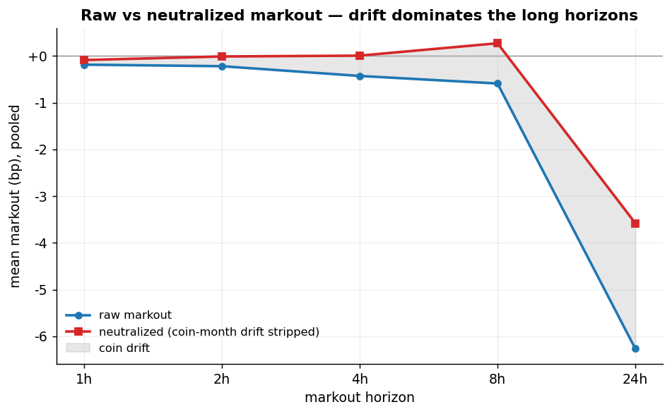 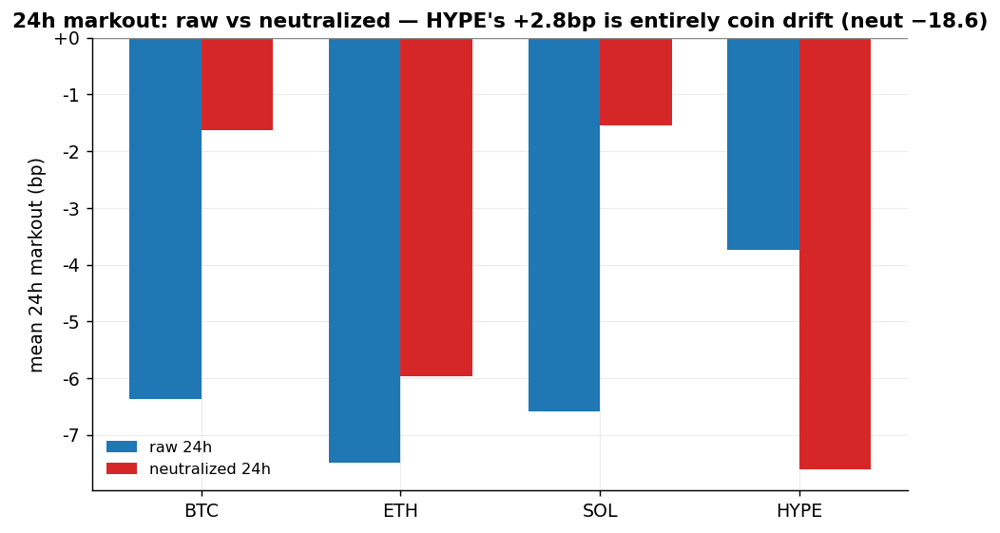

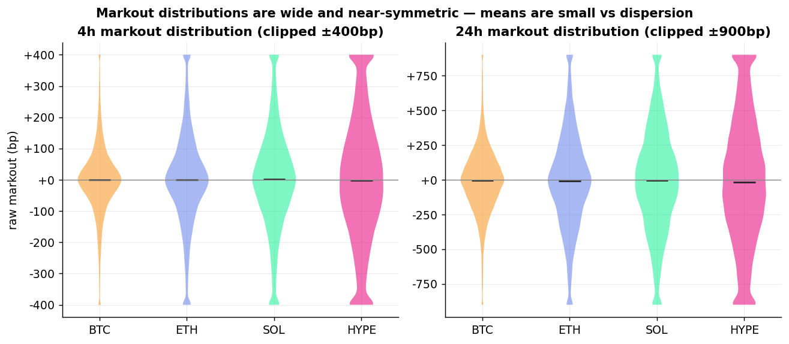

*Cross-checked against an independent whole-market taker field study (N ≈ 0.8–2.1M per coin): BTC bleed, ETH shape, and the HYPE 8h hump all reproduce.*

## 4. Top markout wallets (in-sample)

Ranked on TRAIN mean markout, min 100 entries (the cohort floor is already 200). Sharpe is per-trade (mean/std, un-annualized); MDD\* is on the non-overlapping ≥8h-spaced subset; hit% is share of entries with positive markout. **These are in-sample snapshots — impressive, and (next section) not repeatable.**

**Top 20 by 8h markout:**

| # | wallet | N | mean 8h (bp) | Sharpe | hit% | MDD\* (bp) | med $ |
|--:|---|--:|--:|--:|--:|--:|--:|
| 1 | `0x5aadb434…` | 214 | +132.8 | 0.36 | 69 | 1338 | 12,061 |
| 2 | `0xfd490cf8…` | 236 | +124.2 | 0.65 | 76 | 1676 | 131,053 |
| 3 | `0xdfb34089…` | 248 | +83.3 | 0.33 | 64 | 1400 | 5,535 |
| 4 | `0x172f5a11…` | 202 | +80.2 | 0.16 | 51 | 2917 | 3,225 |
| 5 | `0x1ecc7c22…` | 200 | +78.9 | 0.29 | 61 | 802 | 25,028 |
| … | | | | | | | |
| 20 | `0xcecc2959…` | 221 | +57.6 | 0.19 | 60 | 926 | 493 |

**Top 5 by 1h markout** (only 5 of 20 overlap with the 8h list — "top markout" is horizon-dependent): `0xfe104b72` +36.6 / `0x9899db38` +32.0 / `0xfffa6fc6` +29.8 / `0x413c2724` +26.0 / `0x032ea203` +23.2 bp.

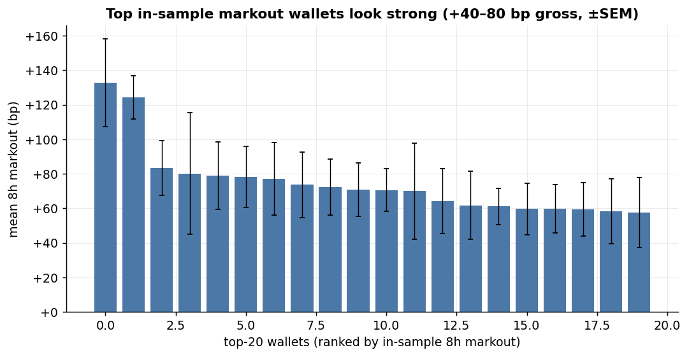 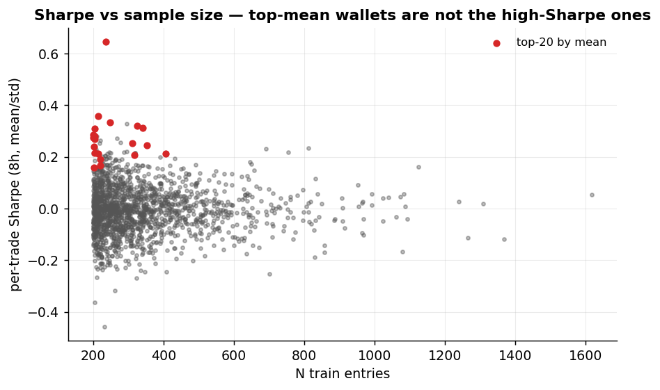

## 5. Top wallets do not persist out-of-sample

This is the core negative result. Ranking wallets by in-sample 8h markout and measuring the same wallets in the test window: **the top deciles regress to the field.**

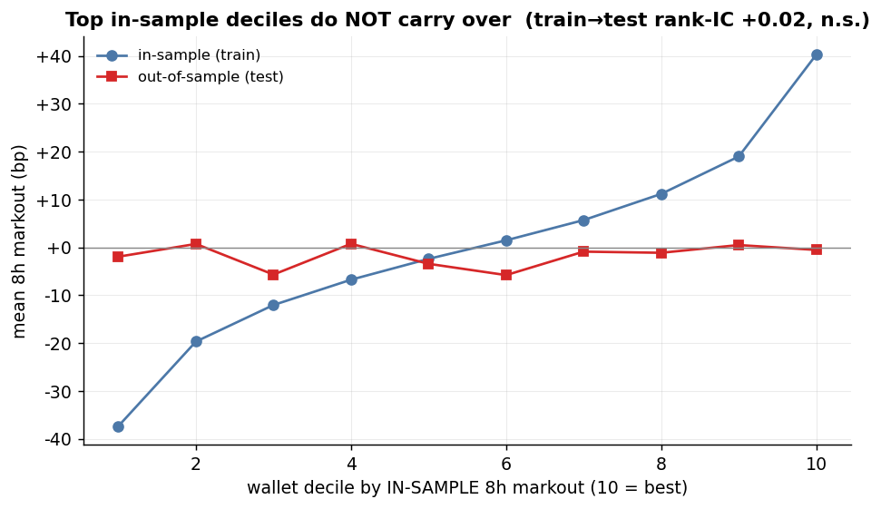 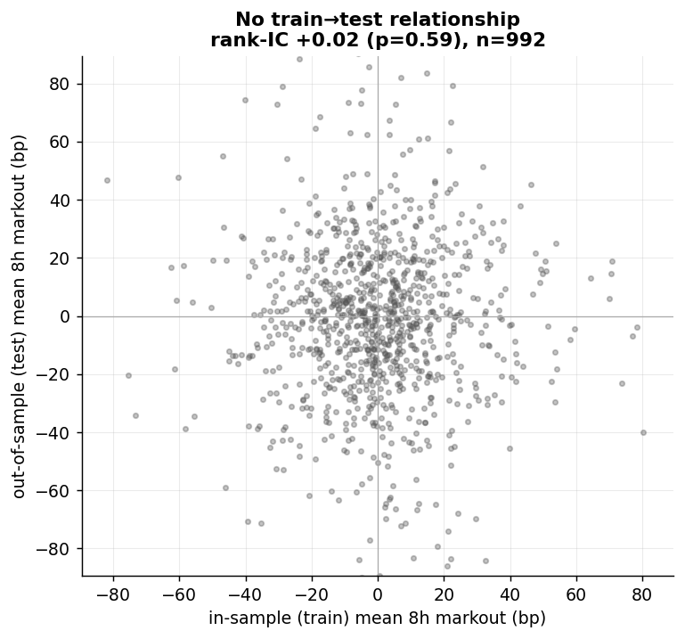

- **Train→test rank-IC = +0.017 (p=0.59)** — no relationship (992 wallets, ≥50 train / ≥15 test entries).
- **The exact top-20 basket** earns +3.75 bp gross [−7.6, +15.3] p=0.26 in test, collapsing to **+0.20 bp at realistic cost**; it depends on ≤2 wallets and flips sign every month.
- **Top-decile → top-decile transition = 1.09× base rate (p=0.22)** — barely above chance.
- **Selection cost:** picking wallets on best in-sample markout yields **−28.7 bp net OOS** (BTC −20 / ETH −36 / SOL −46) — the winner's curse, quantified.
- **Formal test (walk-forward, 9 rankers × thousands of cells):** best BTC p=0.09, **0 survivors after FDR**.

**Every ranking metric we tried failed the same way.** We did not rely on one selector:

| Selector | Ranked on | OOS verdict |
|---|---|---|
| Naive rankings | edge / Sharpe / hit-rate / cum-PnL | inconclusive → blind (MDE 160 bp) |
| Reliability | t-stat, empirical-Bayes shrunk edge | **null** (perm p=0.40, 0 FDR) |
| Robust sweep | 9 rankers × 9,668 cells | nothing graduates (best p=0.17) |
| Behavioral traits | high-vol frac, size CV, add-freq | descriptive only |
| PnL / entry-timing | realized PnL, timing rank | doesn't persist copyably |
| Maker-share strata | taker-purity conditioned | powered ~0 (−0.007) |
| Per-wallet copy-edge | vs mechanical benchmark | power-gate blind |
| Day-weighted top-20 | monthly rank | basket ~0 net |
| Nested wallet features | market-state + wallet | incremental ≈ 0 |

*Two earlier selection studies (a 17-metric per-wallet screen and a sealed cross-validated tournament) reached the same conclusion on the same tape — corroborating, not counted here.*

**But the null is not total.** At the population/decile level a weak signal is real and powered (next two sections handle it under strict both-directions rigor — we neither over-null it nor over-carry it).

## 6. Issues encountered & solutions

A markout study is mostly a fight against measurement artifacts. The load-bearing ones:

**A. Stale-candle pricing (prior copy-trade investigation — the cautionary tale that set this study's pricing).** *Provenance: this finding is from the earlier Hyperliquid copy-trade edge investigation (Jun–Jul 2026), not this cohort pipeline; it is why this study prices post-fill on fine candles.* An apparent **+24 to +31 bp** follower edge (6h, 4/4 folds, CI > 0 even at 22 bp cost) was **entirely a pricing artifact**: entry markout was read off the last *closed hourly candle*, 15–30 min before the actual fill, crediting the follower with the pre-fill run-up and the leader's own impact. The tell was a too-clean lag-decay curve (71 → 64 → 37 → 21). Re-pricing strictly post-fill collapsed the flagship cell **+39.3 → +0.4 bp**; on 15-min candles it went negative. **Fix adopted here:** strictly post-fill, interval-aware next-bar-close pricing on fine candles — the baseline for everything above.

**B. Statistical hygiene.**

| Pitfall | Guard | Outcome |
|---|---|---|
| Survivorship | past-only universe, activity gate, MTM open positions | inflated +159 → +40–92 bp/RT removed |
| Winner's curse (~10k hypotheses) | held-out means, BH-FDR, config-null | −28.7 bp OOS; 0/75 cells survive |
| Look-ahead | fully-closed candles, purge+embargo | a backward-peek z=+3.86 collapsed |
| Gross vs net | realistic HL ~5–6 bp round-trip, turnover-weighted | M1 +3.75 → +0.20 bp net |
| Non-independence | day-block bootstrap + Romano-Wolf | overlapping 8h holds clustered correctly |
| Over-nulling **and** over-carrying | point + CI + positive-control MDE + cross-unit sign | both error directions gated equally |

**C. Bugs we caught in our own pipeline** (via adversarial self-audit), each with before → after:

| Bug | Effect | Fix |
|---|---|---|
| Test-activity in *selection* (`tend≥8`) | inflated M1 basket +6.9 → +3.75; "beats fade" was a leak | train-only freeze, eval-time attrition (99 → 170 wallets) |
| Test-fitted matched-control bins | biased the trigger test | train-fitted, frozen |
| James-Stein shrinkage collapse | flagged 100% of wallets "top" in 4/11 months → recurrence ≥3mo **686 → 48**, transition **3.2× → 1.09× (n.s.)** | raw-rank fallback when τ²=0 |
| Missing positive-control MDE | an implied null wasn't earned | added — window is blind below ~11–16 bp |
| Three conflated "top-decile" sets | ambiguous cohort | one canonical train-only set frozen to disk |

## 7. The persistence that *is* real → the 121 cohort

Ranking *specific* wallets fails, but **rank persistence at the population level is real and powered** — and this is where over-nulling would have buried a genuine signal:

- Adjacent-month **rank-IC 8h = +0.093 [+0.061, +0.126], 10/10 folds, p=0.002** (4h +0.081, 24h +0.085).
- Top-decile **forward markout +5.72 vs field +1.24 = +4.48 bp [+2.17, +7.54], 9/10 folds.**
- Recurrence beyond luck: wallets top-decile in **≥3 months = 48 observed vs 35 by luck (p=0.017)** — the only recurrence threshold that clears.

We freeze the recurring cohort as a single, leak-free, on-disk object: **train-only, day-weighted `neut_8h`, top-decile in ≥2 of 6 training months → 121 wallets** (≥3 months = 28, strict subset).

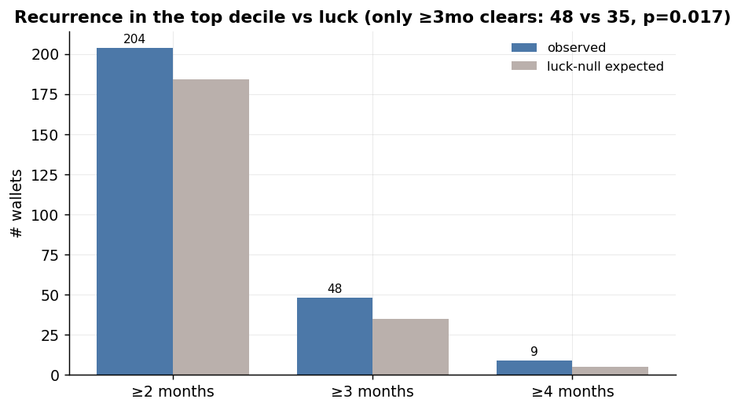 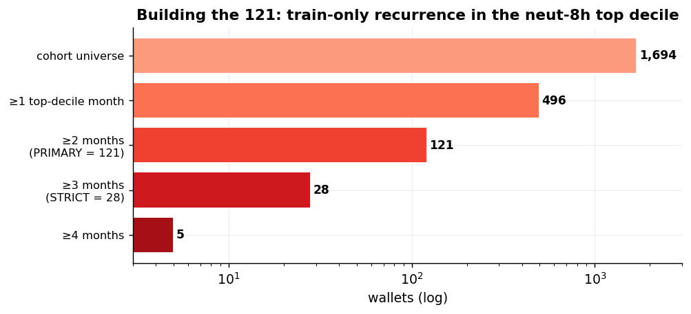

What separates the 121 is **conviction and breadth, not size or activity**: conviction percentile 0.72 vs 0.48 for the field, active in all 4 coins vs 3, near-identical median ticket ($4.1k vs $3.9k), and *fewer* entries (268 vs 291).

## 8. Is the edge skill? The fade decomposition

The 121 cohort's forward markout is real (+4.5 bp) — but is it *wallet skill* or a *market setup* anyone can trade? We benchmark against a costless mechanical fade (`fade_dir = −sign(trailing 8h move)`, priced at the wallets' own entry/exit timestamps so execution cancels):

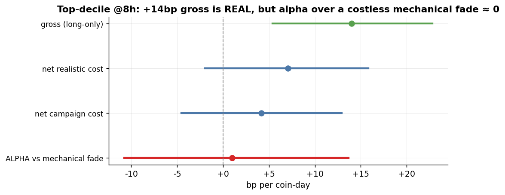

- Top-decile @8h: gross **+13.99 bp** [+5.4, +22.8] is real, net realistic cost **+7.09** — **but alpha over the mechanical fade is +1.00 bp [−10.75, +13.66], p=0.44 (≈0).** The entire gross edge is the fade.

Decomposing further with a matched-control experiment (A = trade wallet's direction; B = fade at wallet times; C = fade everywhere; D = fade at activity-matched *non*-wallet times):

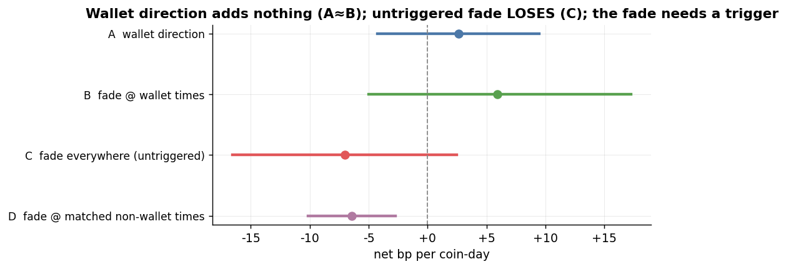

- **Wallet direction adds nothing** (A ≈ B). **The untriggered fade loses money net** (C = −7.0) — so the fade needs a trigger, but the placebo D fails too, and whether wallet activity is a *uniquely* useful trigger is confounded by wallets trading ~13% larger moves.
- A frozen continuous control (fit E[fade | trailing move, vol, coin, time] on non-wallet bars, apply to wallet events) resolves the confound: **per-event residual ≈ 0** (the state fully explains the event fade), while the day-capped residual is **+5.87 bp [−5.5, +17.7]** — positive but the window's **MDE is 11–16 bp**, so it is a *live underpowered positive, not a null.*

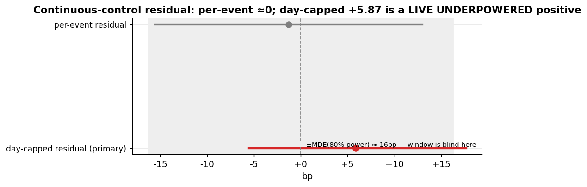

- Confirming from the other direction: a nested model predicting the 8h return from market state (M0) vs market state **+ every wallet feature** (M1: recurring flag, rank, direction, size) gains **−0.0003 cross-fit IC** — wallet identity adds nothing even in-sample.

**Verdict (both gates):** wallet *ranking* persists (real, powered) but it is *generic short-horizon reversal*; wallet *direction* and *timing* add nothing measurable beyond the observable setup; a small day-capped trigger residual survives as underpowered/unresolved, not as demonstrated skill.

## 9. Characterizing the 121

The cohort has a clear, single behavioral signature — **aggressive contrarian mean-reversion**:

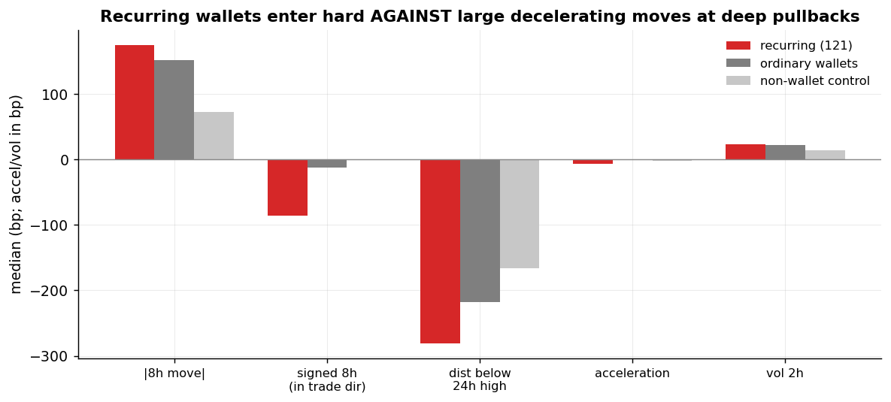

Recurring wallets enter on larger trailing moves (|8h| 175 vs 151 vs 72 bp for control), **hard against the move** (signed 8h-in-direction −86 vs −12 bp), **deeper below the 24h high** (−281 vs −218 vs −166), as the move **decelerates** (accel −6.2 vs 0), at slightly elevated vol. Per wallet, **83% are net faders, 65% fade ≥60% of their entries, 44% ≥70%** — a strong tilt, ~2× the enrichment of ordinary wallets, but *not a monolith* (~17% are net momentum/neutral).

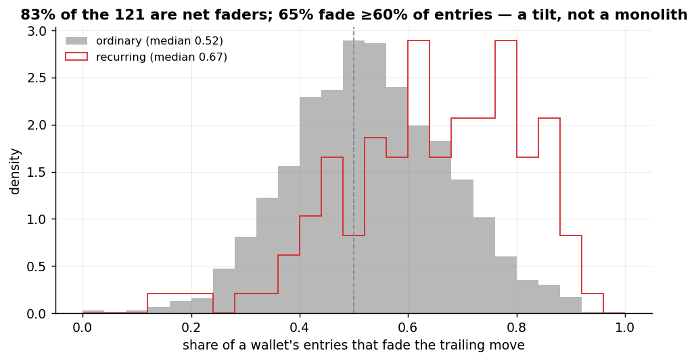

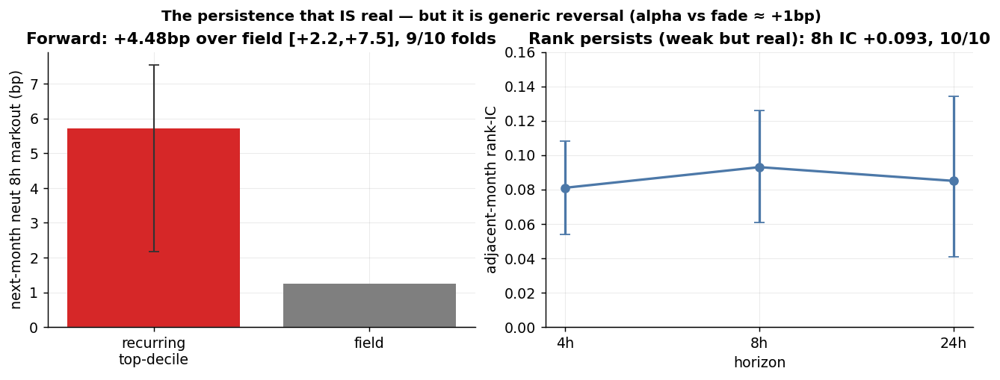

## 10. What we learned

- **Markout ranking of wallets is not a tradeable selector on this tape.** Nine-plus metrics, all horizons — none persist out-of-sample; selection on in-sample markout costs −28.7 bp. This is a powered, repeatedly-audited negative, not an underpowered shrug.
- **There is a real but weak population-level persistence**, and it is **generic short-horizon reversal**: the recurring top-decile is a set of aggressive contrarian faders whose forward edge is a mechanical fade, fully explained by the size of the preceding move. Wallet identity/direction adds ~0.
- **One question stays open, honestly:** whether wallet *activity* is a uniquely useful *trigger* for that fade — the day-capped residual (+5.87 bp) is positive but the historical window is statistically blind below ~11–16 bp. It is carried as a live underpowered positive, resolvable only with forward data, not mined further here.
- **The methodology is the deliverable as much as the result:** post-fill fine-candle pricing, chronological splits with embargo, day-block inference for overlapping trades, positive-control MDEs before any null, and adversarial self-audit that caught five of our own leaks/bugs.

---

*Reproducibility: cohort in `out/cohort_K_entries.parquet` (frozen recurring set `out/cohort_M_frozen.{txt,parquet}`); figures generated by `src/fig_*.py`; full method + audit trail in `docs/FINDINGS_LEDGER.md`. All OOS numbers are chronological train→test; figures entry-weighted unless labeled.*
