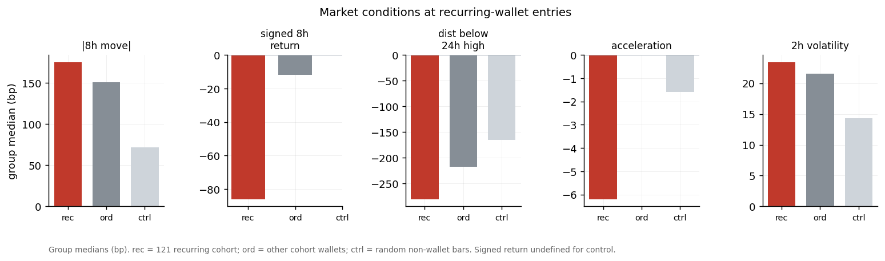
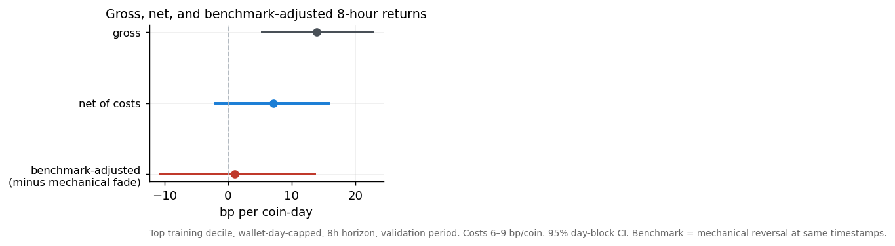
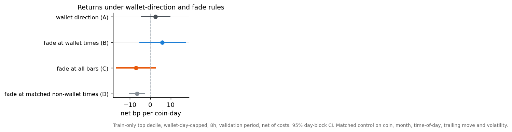
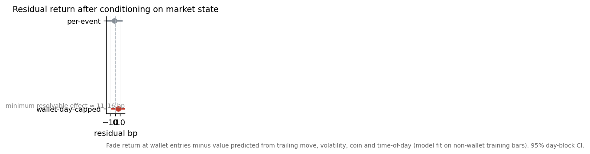

# Wallet-Level Markout on Hyperliquid: Persistence and Copyability

## 1. Research question and summary

Can wallet-level markout identify Hyperliquid traders whose entries contain repeatable and copyable information?

We measure post-fill markout for taker entries on BTC, ETH, SOL and HYPE over August 2025 – June 2026, rank wallets by markout, test whether high-ranked wallets persist out-of-sample, and characterise the wallets that recur.

Three findings:

- Static full-history rankings did not identify a durable top-wallet cohort: wallets ranked on the training period showed no reliable relationship to validation-period markout.
- Rolling monthly ranks showed modest one-month-ahead persistence: the prior-month top decile outperformed the field by approximately 4.4 bp at the 4-hour horizon and 11.4 bp at the 8-hour horizon (neutralized, wallet-day-weighted).
- Recurring high-ranked wallets were predominantly contrarian, entering after larger, decelerating price moves. Their returns were close to those of a mechanical reversal benchmark evaluated at the same timestamps; we found no statistically resolved incremental return attributable to wallet identity or direction, though the sample cannot exclude a smaller day-capped timing effect.

## 2. Data and methodology

**Universe and dates.** 7,332,013 taker entries from 32,949 wallets across 273 instruments, 2025-08-01 to 2026-06-30 (UTC). The analysis is restricted to BTC, ETH, SOL and HYPE.

**Cohort.** To study copyable behaviour we freeze a mid-frequency taker cohort, selected on identity rather than performance: ≥200 majors fills, taker share ≥ 0.70, median round-trip hold 1–24 h, and ≥200 training entries. This yields **1,694 wallets and 812,616 priced entries** (funnel: 29,334 wallets with ≥200 fills → 12,544 copyable takers → 1,694).

**Splits.** Training < 2026-02-01 (583,032 entries); embargo February 2026 (61,116, discarded); validation 2026-03-01 to 06-30 (168,468). The validation window is a −10.85% BTC period.

**Observation unit.** One observation is a position-increasing taker decision: a `(wallet, coin, bar, direction)` cell. A fill is scored only if it is taker-crossed, non-wash, and increases absolute position; maker, wash and position-reducing fills are tracked for position accounting but not scored. Same-bar, same-direction opening fills are aggregated into one entry at the shared next-bar price. Scaling into a position across several bars therefore produces several entries, each weighted once.

**Markout.** For horizon *h*, markout = `dir · (close(first bar after entry + h) / close(first bar after entry) − 1)`, in basis points. Both endpoints use the first bar strictly after the timestamp, so pricing is post-fill. This is a hypothetical gross signed price return; it excludes spread, fees, funding and any modelled exit, and is not realized PnL. Horizons: 1, 2, 4, 8, 24 h.

**Weighting.** Results are labelled by weighting: term-structure and top-wallet tables are entry-weighted; the wallet-skill comparison is wallet-equal-weighted; persistence and decile tests are wallet-day-weighted; deployability estimates are wallet-day-capped (equal capital per wallet-day).

**Inference.** Confidence intervals use a calendar-day block bootstrap, which preserves the dependence induced by overlapping forward windows and same-day cross-wallet correlation. Selection tests across many wallets/metrics are controlled with Benjamini–Hochberg FDR and, where a single best cell is reported, a Romano–Wolf maximum-statistic null. Cost assumptions use a placeholder 6–9 bp per-coin round-trip, treated as an upper bound pending order-book calibration.

**Limitation.** The March–June validation window was examined repeatedly during the study and informed later specification choices (cohort horizon, cost model, control design). Validation results are therefore historical / exploratory out-of-sample; only prospective data can provide clean confirmation.

## 3. Baseline markout results

Entry-weighted markout by coin and horizon is small relative to its dispersion. Pooled across coins, the mean is −0.19 bp at 1 h and −0.60 bp at 8 h, with day-block intervals spanning zero at every horizon through 8 h; only the 24-h horizon is materially negative (−6.3 bp pooled; BTC −6.4 bp, interval excluding zero). HYPE is the only coin with a positive short-horizon mean (about +3 bp at 8 h), but its interval spans zero and its 24-h raw mean (+2.8 bp) reverses to −18.6 bp once the coin's own monthly drift is removed. Most of the visible coin-level structure is within sampling noise at the day-block level.

Neutralising each coin's monthly mean forward return removes most of the long-horizon movement, indicating that the raw 24-h figures are largely coin drift rather than entry-timing information.

Dispersion grows with horizon (pooled standard deviation ≈ 93 bp at 1 h to ≈ 363 bp at 24 h); per-coin quantiles are tabulated in the appendix.

## 4. Wallet-rank persistence

We separate two analyses that answer different questions.

**Static ranking.** Wallets are ranked once on the training period and measured in validation. The relationship is weak: the train-to-validation rank correlation of mean 8-hour markout is approximately +0.02 (not significant, n ≈ 990), and the highest training deciles do not retain an advantage in validation. Selecting wallets on best in-sample markout produces −28.7 bp net in validation. A formal walk-forward selection test across nine ranking metrics and thousands of cells returned a best coin p-value of 0.09 with no survivors after FDR control.

**Rolling ranking.** Wallets are re-ranked each month and evaluated one month ahead. Here a modest signal is present: the adjacent-month rank correlation of neutralized, wallet-day-weighted markout is +0.093 at 8 h (95% interval [+0.061, +0.126]; positive in 10 of 10 folds), with similar values at 4 h (+0.081) and 24 h (+0.085). The prior-month top decile outperformed the field by +4.4 bp at 4 h ([+1.8, +6.8]) and +11.4 bp at 8 h ([+5.3, +17.0]).

The two analyses lead to different conclusions and should not be combined: static full-history selection did not generalise, whereas the rolling cross-sectional ranking exhibited modest one-month-ahead predictive value.

Requiring recurrence sharpens this. Counting how often a wallet appears in the monthly top decile against a binomial chance benchmark: appearance in ≥3 months (48 wallets observed vs 35 expected, p = 0.017) exceeds chance; the ≥2-month (204 vs 184, p = 0.059) and ≥4-month (9 vs 5, p = 0.066) counts do not clear the 0.05 threshold.

## 5. Behavioral and benchmark decomposition

**Recurring cohort.** We freeze a recurring cohort as wallets in the top decile in at least two of the six training months (121 wallets), using drift-neutralized 8-hour markout and wallet-day weighting. The two-month threshold was chosen for breadth and statistical power (121 wallets versus 28 at a three-month threshold); only the three-month subset independently cleared the chance benchmark above, so the 121 should be read as a broad recurring set rather than 121 individually established repeat performers. What distinguishes the cohort is conviction and cross-coin breadth rather than size or activity: mean training rank percentile 0.72 versus 0.48 for the field, activity in all four coins versus three, near-identical median ticket (about $4.1k), and a modest long bias.

**Entry conditions.** Recurring-cohort entries occur after larger trailing moves and deeper pullbacks than other wallets or random bars, and against the direction of the preceding move.

At the wallet level this contrarian tendency is common but not universal: 83% of the 121 have a net-contrarian entry record and 65% fade the trailing move on at least 60% of entries, versus a median contrarian share of 0.67 for the cohort against 0.52 for other wallets.

**Benchmark comparison.** We compare the high-markout wallets' returns to a mechanical reversal benchmark (`fade_dir = −sign(trailing 8-hour move)`) evaluated at the same timestamps, so execution effects cancel in the difference. For the training-ranked top decile at 8 h, gross return is +14.0 bp ([+5.4, +22.8]) and net of costs +7.1 bp; the benchmark-adjusted return is +1.0 bp ([−10.75, +13.66], p = 0.44). Most of the estimated advantage is captured by the mechanical benchmark.

Decomposing the timing question: trading in the wallet's direction did not improve on the fade at the same times (A versus B, difference not resolved), the unconditional fade is negative net of costs (C = −7.0 bp), and the fade at activity-matched non-wallet times is also negative (D = −6.4 bp). Wallet direction did not improve performance in this specification.

Conditioning the fade return on observable market state (trailing move, volatility, coin, time of day), fit on non-wallet training bars and applied to wallet entries, leaves a per-event residual near zero (−1.3 bp) and a wallet-day-capped residual of +5.9 bp ([−5.5, +17.7]). The minimum effect this validation sample can resolve is approximately 11–16 bp, so a smaller incremental timing effect cannot be excluded, but none is established. A nested return model confirms the direction of this result: adding wallet identity, rank, direction and size to a market-state model changed cross-fit predictive correlation by −0.0003.

In summary: the recurring cohort's entry returns are consistent with a short-horizon reversal pattern; observable market-state variables explained most of the estimated advantage; no incremental return from wallet identity or direction was statistically resolved; a smaller day-capped timing effect remains possible within the confidence interval and the sample's resolution.

## 6. Conclusion and forward test

Static rankings of wallet-level markout did not generalise reliably from the training period to the historical validation period. Rolling monthly ranks exhibited modest one-month-ahead persistence, with the prior-month top decile outperforming the field by approximately 4.4 bp at 4 h and 11.4 bp at 8 h (neutralized, wallet-day-weighted).

Recurring high-ranked wallets were predominantly contrarian and tended to enter after larger, decelerating price moves. Their estimated returns were similar to those of a mechanical reversal benchmark evaluated at the same timestamps. We therefore find no statistically resolved incremental return attributable to wallet identity or direction, although the available sample cannot exclude a smaller day-capped timing effect.

These findings motivate a prospective comparison of a market-state reversal model against the same model augmented with wallet information. The prospective test will compare, on new data, a rule driven by the market-state model alone, the same rule augmented with recurring-wallet activity and direction, and direct copying of wallet direction, under identical capital constraints and a fixed 8-hour horizon, with execution, spread, fees and funding logged. Because the historical validation window informed subsequent specifications, its results are treated as exploratory; forward data is required for confirmation.

---

## Appendix

### A. Methodology controls

Point estimates are entry-weighted unless labelled; inference uses a calendar-day block bootstrap to handle overlapping forward windows and same-day cross-wallet correlation. Selection across metrics is FDR-controlled. Pricing is strictly post-fill (next bar after entry) on fine candles; an earlier hourly-candle pricing scheme was found to credit entries with pre-fill price movement and was replaced. During the study we identified and corrected five pipeline issues, listed in Section C.

### B. Trade size and dispersion

Per-coin trade-size quantiles and 8-hour markout dispersion are in `out/appendix_tables.md` (trade size median ≈ $4k with a heavy right tail past $1M; 8-hour markout standard deviation 130–330 bp by coin). Regime composition, hold-time distribution and monthly volume are in `figs/03_regime.png`, `figs/03_holdtime.png`, `figs/03_temporal.png`.

### C. Corrections made during the study

| Item | Before → after |
|---|---|
| Test-period activity used in wallet selection | removed; train-only selection with eval-time attrition (99 → 170 wallets) |
| Test-fitted matched-control bins | refit on training data only |
| Shrinkage estimator degenerate in 4 of 11 months | flagged 100% of wallets as top-decile; corrected to a raw-rank fallback; recurrence at ≥3 months 686 → 48, transition 3.2× → 1.09× (not significant) |
| No positive-control power check | added; validation window resolvable effect ≈ 11–16 bp |
| Three inconsistent top-decile definitions | consolidated to one train-only recurring set, frozen to disk |

### D. Top training-decile wallets (in-sample reference)

Top wallets by training 8-hour markout, with per-trade Sharpe (mean/standard-deviation of markout, un-annualized), hit rate, and maximum drawdown computed on a non-overlapping (≥8-hour-spaced) entry subset. These are in-sample descriptive values; Section 4 shows they do not persist.

| # | wallet | N | mean 8h (bp) | Sharpe | hit% | MDD (bp) | med $ |
|--:|---|--:|--:|--:|--:|--:|--:|
| 1 | `0x5aadb434…` | 214 | +132.8 | 0.36 | 69 | 1338 | 12,061 |
| 2 | `0xfd490cf8…` | 236 | +124.2 | 0.65 | 76 | 1676 | 131,053 |
| 3 | `0xdfb34089…` | 248 | +83.3 | 0.33 | 64 | 1400 | 5,535 |
| 4 | `0x172f5a11…` | 202 | +80.2 | 0.16 | 51 | 2917 | 3,225 |
| 5 | `0x1ecc7c22…` | 200 | +78.9 | 0.29 | 61 | 802 | 25,028 |

Drawdown on the raw overlapping-horizon markout series is not reported because it scales with trade cadence rather than risk.

### E. Number-to-source map

See `docs/NUMBER_SOURCE_MAP.md` for each headline estimate mapped to its generating script and output file.
