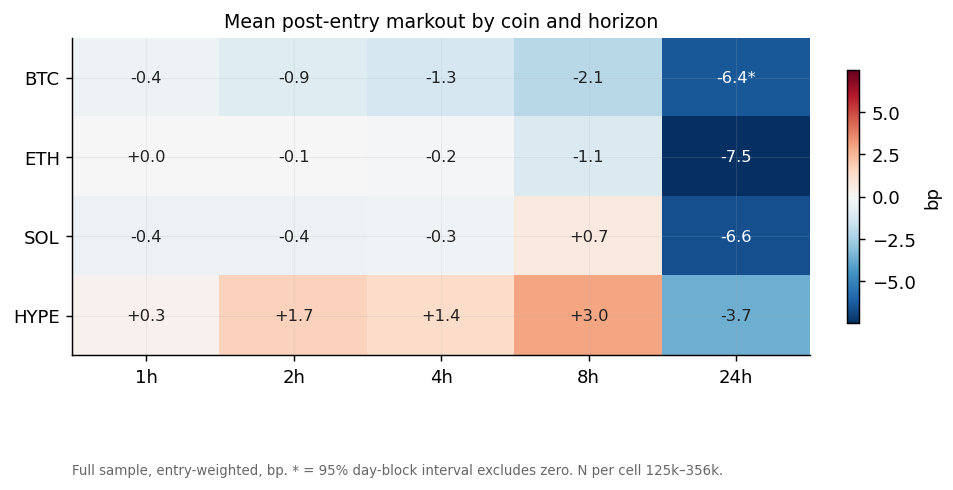
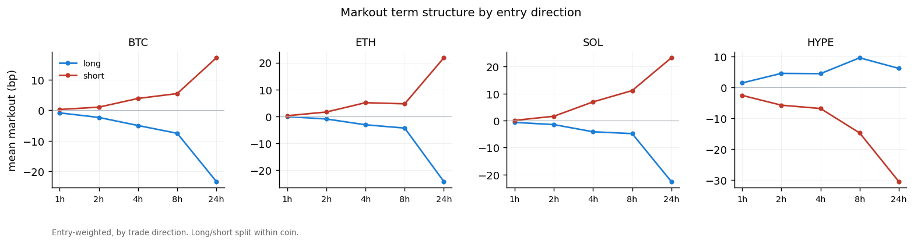
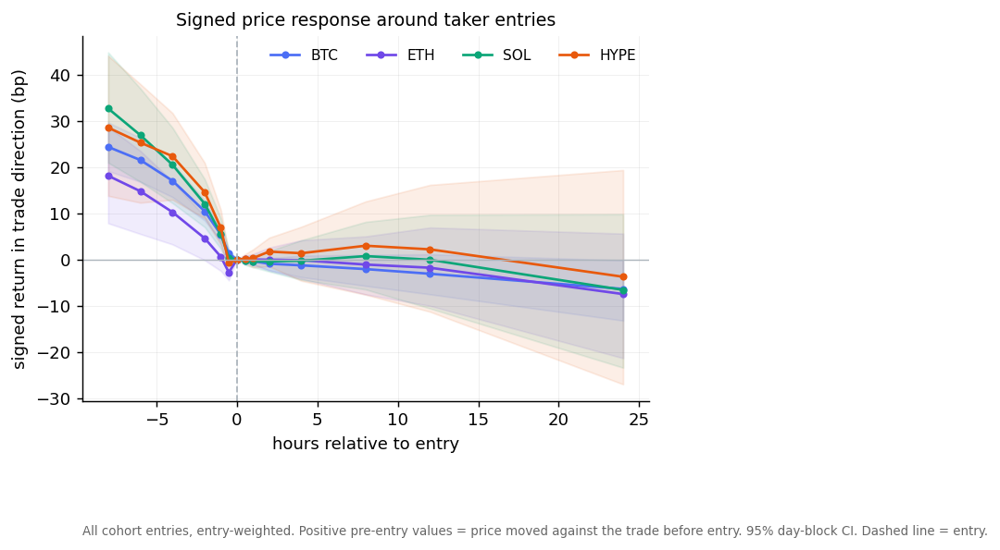
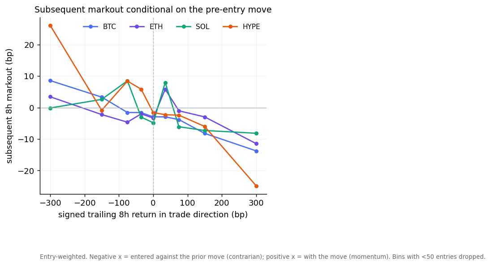
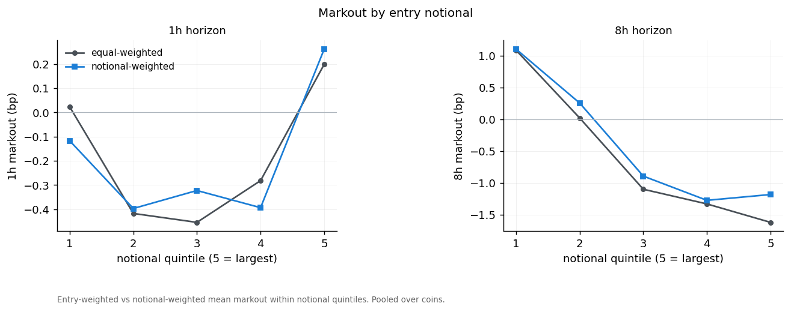
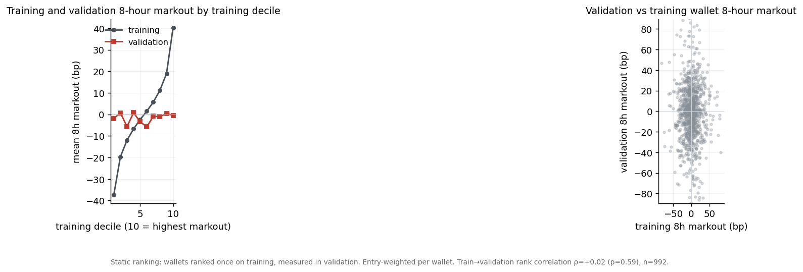
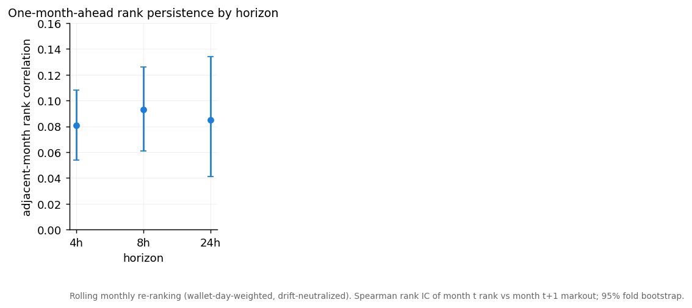
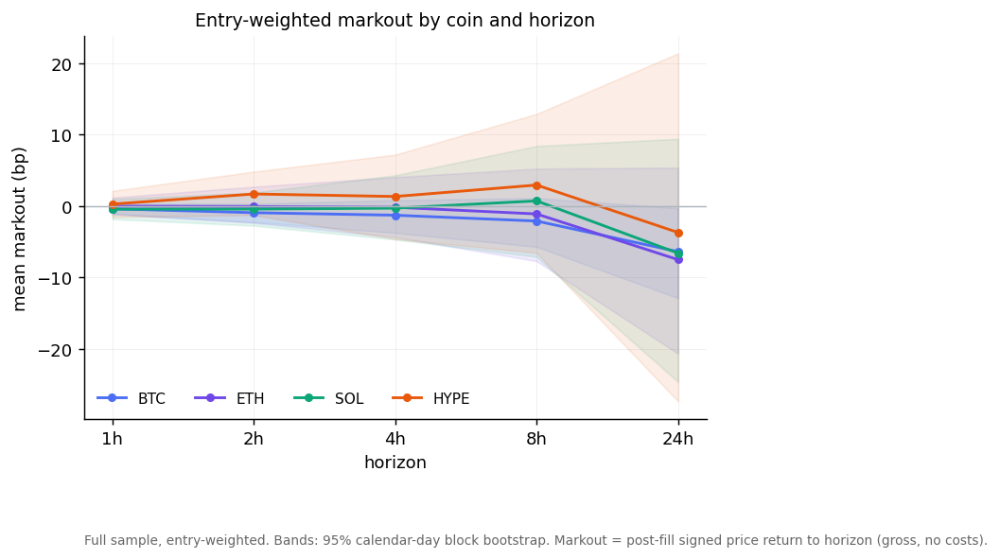
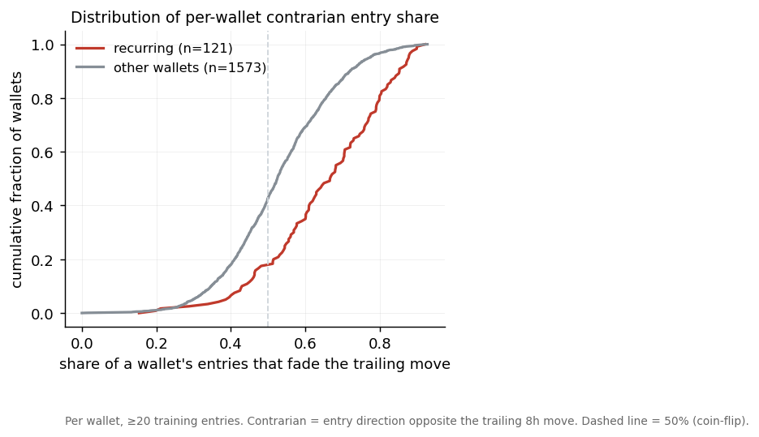

# Hyperliquid Taker Markouts, and Whether Markout Identifies Informed Wallets

## 1. Executive summary

This study addresses two linked questions. First, what do post-entry taker markouts look like across BTC, ETH, SOL and HYPE? Second, do persistent cross-wallet differences in markout identify informed or copyable traders?

The metric throughout is a post-fill decision markout: `direction × (future price / post-fill entry price − 1)`, in basis points. It measures the signed price movement after an entry decision. It is not realized PnL, and without fill-versus-midprice order-book data it is not a full execution-quality markout.

Part I finds that aggregate taker markout is small relative to per-entry dispersion. Pooled mean markout is within about 1 bp of zero through 8 hours and negative at 24 hours; per-coin means are mostly not distinguishable from zero under day-block resampling, and directional hit rates are near 50%. Entries systematically follow adverse short-horizon moves: the trade-direction-signed price change over the eight hours before entry is positive (roughly +18 to +33 bp), and subsequent markout declines monotonically in the size of the preceding move. Taker entries in this cohort are, on average, contrarian.

Because pooled estimates can conceal informed subgroups, Part II tests whether cross-wallet differences in markout are persistent and useful for selection. Static full-history rankings did not generalise from training to validation. Rolling monthly ranks showed modest one-month-ahead persistence (prior-month top decile ahead of the field by about 4.4 bp at 4 h and 11.4 bp at 8 h, neutralized and wallet-day-weighted). Recurring high-ranked wallets were predominantly contrarian, and their returns were close to a mechanical reversal benchmark evaluated at the same timestamps; we found no statistically resolved incremental return attributable to wallet identity or direction, though the sample cannot exclude a smaller day-capped timing effect.

---

# Part I — Hyperliquid taker markouts

## 2. Data and markout methodology

**Universe and dates.** 7,332,013 taker entries from 32,949 wallets, 2025-08-01 to 2026-06-30 (UTC). The analysis is restricted to BTC, ETH, SOL and HYPE.

**Cohort.** A mid-frequency taker cohort is frozen on identity rather than performance: ≥200 majors fills, taker share ≥ 0.70, median round-trip hold 1–24 h, ≥200 training entries. This yields 1,694 wallets and 812,616 priced entries.

**Observation unit.** One observation is a position-increasing taker decision, a `(wallet, coin, bar, direction)` cell. A fill is scored only if it is taker-crossed, non-wash, and increases absolute position; maker, wash and position-reducing fills are tracked for position accounting but not scored. Same-bar, same-direction opening fills are aggregated into one entry at the shared next-bar price; scaling into a position across several bars produces several entries; a direction flip is scored per leg.

**Markout.** For horizon *h*, markout = `dir × (close(first bar after entry + h) / close(first bar after entry) − 1)`, in basis points. Both endpoints use the first bar strictly after the timestamp, so pricing is post-fill. This is a hypothetical gross signed price movement; it excludes spread, fees, funding and any modelled exit, and is not realized PnL. Horizons: 1, 2, 4, 8, 24 h.

**Adjusted measures.** Raw markout is the price movement itself. Drift-neutralized markout subtracts, for each coin-month and horizon, that coin's own mean forward return over the month (`raw − dir × monthly-drift`), removing the component attributable to the coin's own trend. A beta/market-adjusted measure is defined (subtract each entry's contemporaneous BTC return over the same horizon) but deferred; drift-neutralization is the adjusted measure reported.

**Weighting.** Term-structure and distribution results are entry-weighted; wallet-level results are wallet-equal-weighted; persistence and decile tests are wallet-day-weighted; deployability estimates are wallet-day-capped.

**Inference.** Confidence intervals use a calendar-day block bootstrap, which preserves the dependence induced by overlapping forward windows and same-day cross-wallet correlation. Selection across many wallets or metrics is controlled with Benjamini–Hochberg FDR. Cost assumptions use a placeholder 6–9 bp per-coin round-trip, treated as an upper bound.

**Splits and limitation.** Training < 2026-02-01; embargo February 2026; validation 2026-03-01 to 06-30. The validation window was examined repeatedly during the study and informed later specification choices, so Part II validation results are exploratory; forward data is required for confirmation.

## 3. Aggregate markout term structure

Mean markout is small and its confidence interval is wide relative to the mean at every horizon through 8 hours. Directional hit rates are close to 50%.

| Coin | Horizon | Mean bp | 95% CI | Median bp | Hit rate | Std bp | N |
|---|---|--:|--:|--:|--:|--:|--:|
| BTC | 1h | −0.37 | [−1.1, +0.3] | +0.0 | 49.9% | 65 | 356,077 |
| BTC | 8h | −2.08 | [−5.7, +1.1] | +0.1 | 50.0% | 151 | 355,894 |
| BTC | 24h | −6.37 | [−12.9, −0.3] | −3.2 | 49.3% | 250 | 355,371 |
| ETH | 8h | −1.09 | [−7.7, +5.2] | +0.9 | 50.2% | 226 | 195,786 |
| SOL | 8h | +0.74 | [−7.1, +8.4] | +3.5 | 50.6% | 258 | 135,299 |
| HYPE | 8h | +2.96 | [−6.6, +12.9] | −0.3 | 49.8% | 332 | 125,207 |
| ALL | 8h | −0.60 | [−5.4, +3.9] | +0.7 | 50.1% | 224 | 812,186 |

The full table is in the appendix. Only the 24-hour horizon is materially negative, and only for BTC does its interval exclude zero. HYPE has the largest positive short-horizon mean, but its interval spans zero.

Splitting by trade direction, long and short entries show similar term-structure shapes within each coin; aggregate signed markout does not hide a large asymmetry between rallies and sell-offs.

Neutralising each coin's monthly drift removes most of the long-horizon movement (appendix), indicating the 24-hour figures are largely coin trend rather than entry timing.

## 4. Conditional markouts

The timing context of entries is more informative than the unconditional mean. Aligning all entries at their decision bar, the trade-direction-signed price change over the eight hours before entry is positive for every coin (about +18 to +33 bp) and declines toward zero at entry; post-entry, the signed path is roughly flat to slightly negative. Entries occur after moves that ran against the eventual trade direction and had largely exhausted by the entry bar.

Conditioning subsequent 8-hour markout on the signed pre-entry move makes the pattern explicit: entries placed against a large prior move (contrarian) are followed by positive markout, while entries placed with a large prior move (momentum) are followed by negative markout. The relationship is monotone and decreasing across all four coins.

Bucketing by entry notional, larger taker decisions do not show higher markout; equal-weighted and notional-weighted means are similar across size quintiles, consistent with larger entries contributing impact and noise rather than additional information.

## 5. Stability, distributions and execution limitations

Mean 8-hour markout varies month to month and thins in later, increasingly BTC-heavy months; sparse cells should be read cautiously.

The per-entry return distribution is wide and near-symmetric: at 8 hours the interquartile range is on the order of ±100 bp with 5th/95th percentiles several times larger, so the small means sit well inside the dispersion (appendix distribution plot and quantile table). Markout by realized-volatility quintile and time-of-day is in the appendix.

**Execution-analysis limitation.** This report measures post-entry decision markout using candle prices. A full execution-markout analysis would require actual fill price, contemporaneous midprice, spread, order-book depth and immediate price impact. With order-book data a future study would add: fill-to-mid implementation shortfall; immediate markout at the seconds-to-minutes scale; spread paid; price impact versus trade size; and adverse selection versus liquidity and depth. The present analysis does not measure any of these; its markout reflects post-fill candle-to-candle price movement only.

---

# Part II — Search for informed wallets

Aggregate taker markout is small relative to per-entry dispersion, but pooled estimates may conceal informed subgroups. We therefore test whether cross-wallet differences in markout are persistent and economically useful for wallet selection or copy trading.

## 6. Cross-wallet heterogeneity

Wallet-level mean markout is dispersed, but much of the spread is sampling noise: high in-sample means concentrate among wallets with fewer entries, and selecting wallets on best in-sample markout produces −28.7 bp in validation. Top in-sample wallets (appendix table) reach +40 to +130 bp gross at 8 h with near-50–75% hit rates; these are descriptive in-sample values, not evidence of a repeatable edge.

## 7. Static and rolling persistence

Two analyses are kept separate.

Under static ranking, wallets are ranked once on training and measured in validation. The train-to-validation rank correlation of mean 8-hour markout is approximately +0.02 (not significant, n ≈ 990), the highest training deciles do not retain an advantage, and a walk-forward selection across nine metrics returned a best coin p-value of 0.09 with no survivors after FDR control.

Under rolling ranking, wallets are re-ranked each month and evaluated one month ahead. Here a modest signal is present: the adjacent-month rank correlation of neutralized, wallet-day-weighted markout is +0.093 at 8 h ([+0.061, +0.126]; positive in 10 of 10 folds). The prior-month top decile outperformed the field by +4.4 bp at 4 h ([+1.8, +6.8]) and +11.4 bp at 8 h ([+5.3, +17.0]). These estimates belong to the dynamic monthly ranking and are not attributed to the fixed cohort defined below.

Counting recurrence against a chance benchmark, appearance in the monthly top decile in ≥3 months (48 wallets vs 35 expected, p = 0.017) exceeds chance; ≥2 months (204 vs 184, p = 0.059) and ≥4 months (9 vs 5, p = 0.066) do not clear 0.05.

## 8. Recurring-wallet characterization

We freeze a recurring cohort as wallets in the top decile in at least two of the six training months (121 wallets), on drift-neutralized 8-hour markout with wallet-day weighting. The two-month threshold was chosen for breadth and statistical power; only the three-month subset (28 wallets) independently cleared the chance benchmark, so the 121 are a broad recurring set rather than 121 individually established repeat performers. What distinguishes them is conviction and cross-coin breadth rather than size or activity (mean training rank percentile 0.72 vs 0.48; four coins vs three; near-identical median ticket).

Their entries occur after larger trailing moves and deeper pullbacks than other wallets or random bars, and against the direction of the preceding move.

At the wallet level this contrarian tendency is common but not universal: 83% of the 121 have a net-contrarian entry record and 65% fade the trailing move on at least 60% of entries (appendix ECDF).

## 9. Benchmark, copyability and forward test

We compare the high-markout wallets to a mechanical reversal benchmark (`fade_dir = −sign(trailing 8-hour move)`) evaluated at the same timestamps, so execution effects cancel in the difference. For the training-ranked top decile at 8 h, gross return is +14.0 bp ([+5.4, +22.8]) and net of costs +7.1 bp; the benchmark-adjusted return is +1.0 bp ([−10.75, +13.66], p = 0.44).

Trading in the wallet's direction did not improve on the fade at the same times, the unconditional fade is negative net of costs, and the fade at activity-matched non-wallet times is also negative (appendix). Conditioning the fade return on observable market state leaves a per-event residual near zero and a wallet-day-capped residual of +5.9 bp ([−5.5, +17.7]); the minimum effect this validation sample can resolve is about 11–16 bp, so a smaller incremental effect cannot be excluded but none is established. Adding wallet identity, rank, direction and size to a market-state return model changed cross-fit predictive correlation by −0.0003.

The fixed 121-cohort was tested independently over the validation period (neutralized 8-hour, wallet-day-weighted): +10.4 bp above the field (n = 93). This is exploratory for the reasons in Section 2 and is close to the mechanical-reversal magnitude, consistent with reversal exposure rather than resolved wallet skill.

A prospective test is required to separate these. It will compare, on new data, a market-state reversal model, the same model augmented with recurring-wallet activity and direction, and direct copying of wallet direction, under identical capital constraints and a fixed 8-hour horizon, logging execution, spread, fees and funding.

## 10. Conclusion

Aggregate taker markout on the four majors is small relative to per-entry dispersion and largely indistinguishable from zero through 8 hours, with a negative 24-hour drift concentrated in BTC. Entries are, on average, contrarian: they follow adverse short-horizon moves, and subsequent markout decreases in the size of the preceding move.

Cross-wallet differences are only weakly persistent. Static full-history rankings did not generalise to the validation period. Rolling monthly ranks showed modest one-month-ahead persistence. Recurring high-ranked wallets were predominantly contrarian, and their estimated returns were close to a mechanical reversal benchmark evaluated at the same timestamps; no statistically resolved incremental return attributable to wallet identity or direction was found, though a smaller day-capped timing effect remains possible within the confidence interval and the sample's resolution. Because the validation window informed later specifications, these results are exploratory, and a prospective comparison of a market-state model against a wallet-augmented model is required for confirmation.

---

## Appendix

### A. Full markout term-structure table
`out/core_markout_table.md` (all coins × 1/4/8/24 h; mean, 95% day-block CI, median, hit rate, standard deviation, N).

### B. Term structure with intervals, and raw vs neutralized

### C. Distribution and secondary conditioning

Per-coin trade-size and 8-hour dispersion quantiles: `out/appendix_tables.md`.

### D. Wallet-level detail
Per-wallet contrarian share (ECDF), returns under wallet-direction and fade rules, and the market-state residual:

Top training-decile wallets (in-sample descriptive; do not persist per Section 7):

| # | wallet | N | mean 8h (bp) | Sharpe | hit% | MDD (bp) | med $ |
|--:|---|--:|--:|--:|--:|--:|--:|
| 1 | `0x5aadb434…` | 214 | +132.8 | 0.36 | 69 | 1338 | 12,061 |
| 2 | `0xfd490cf8…` | 236 | +124.2 | 0.65 | 76 | 1676 | 131,053 |
| 3 | `0xdfb34089…` | 248 | +83.3 | 0.33 | 64 | 1400 | 5,535 |
| 4 | `0x172f5a11…` | 202 | +80.2 | 0.16 | 51 | 2917 | 3,225 |
| 5 | `0x1ecc7c22…` | 200 | +78.9 | 0.29 | 61 | 802 | 25,028 |

Sharpe is per-trade (mean/standard deviation of markout, un-annualized); MDD is on a non-overlapping ≥8-hour-spaced subset. Universe funnel, hold-time distribution, regime composition and monthly volume: `figs/`.

### E. Corrections and provenance
Study corrections (selection leakage, matched-control bins, a degenerate shrinkage estimator, a positive-control power check, cohort consolidation) are in `docs/CHANGELOG_v2.md` and `docs/FINDINGS_LEDGER.md`. Every headline number maps to its script and output in `docs/NUMBER_SOURCE_MAP.md`.
