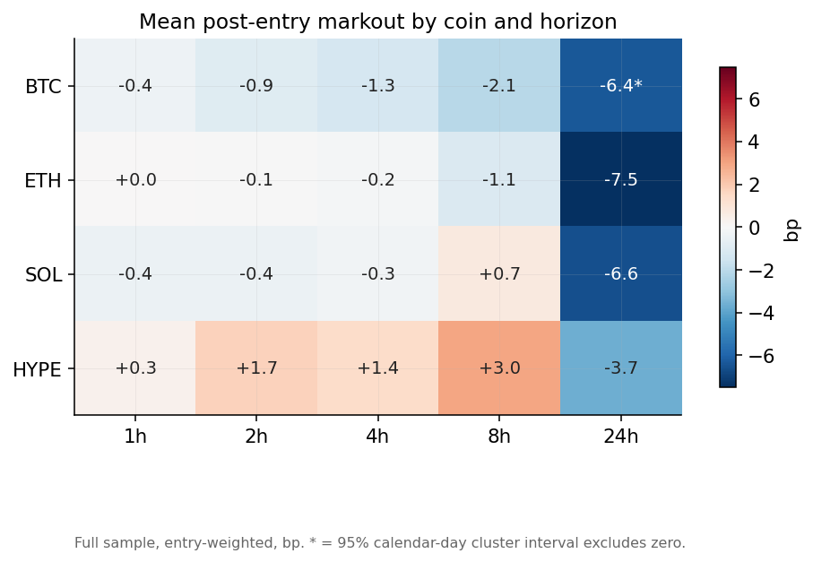
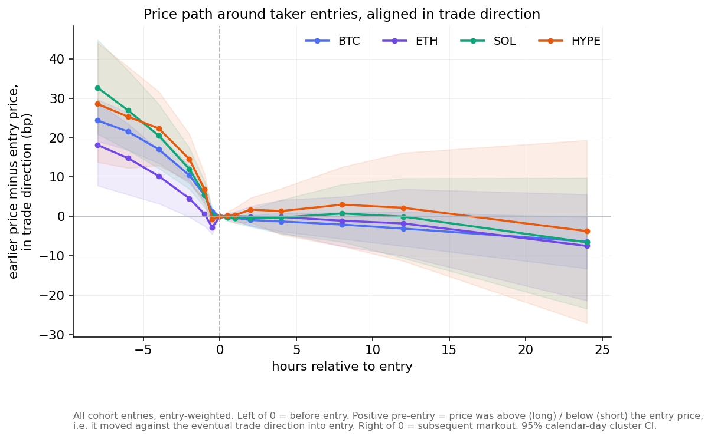
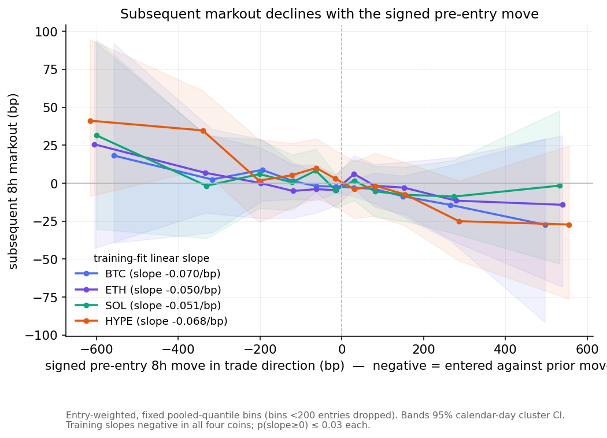
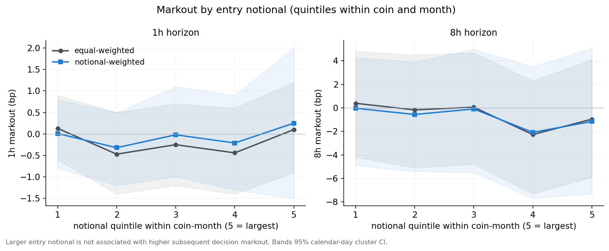
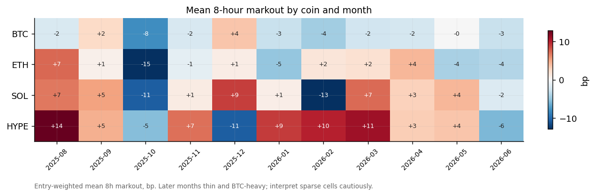
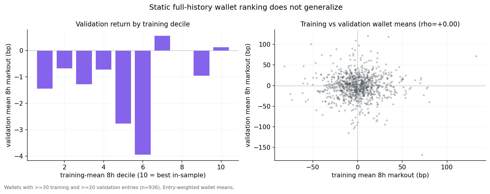
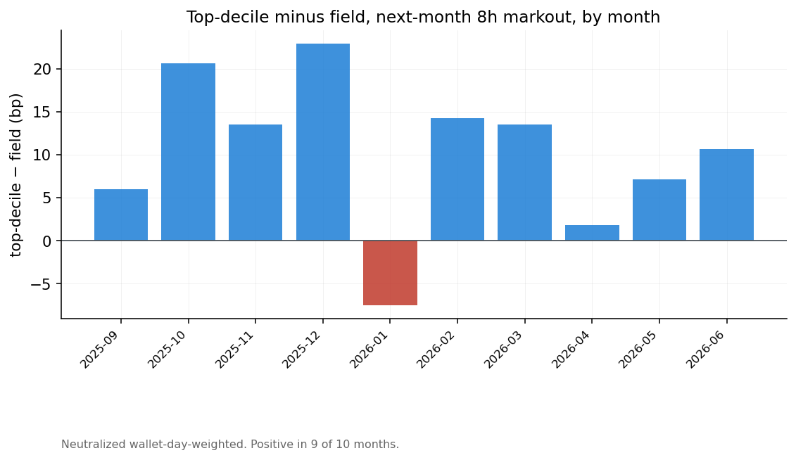
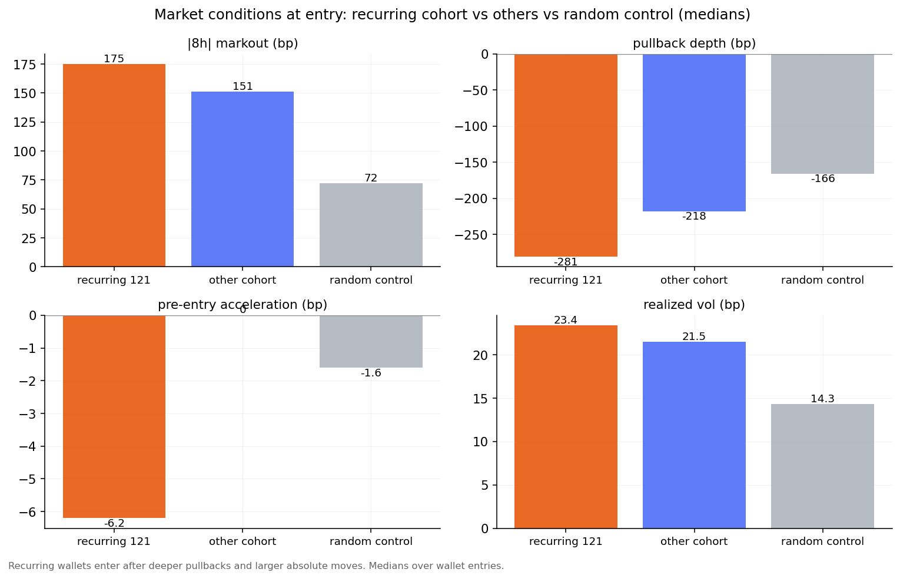
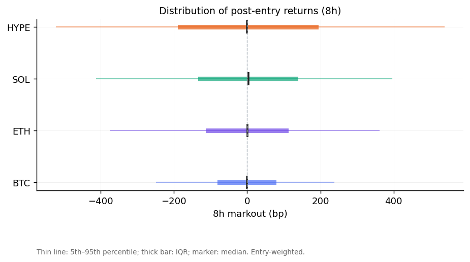
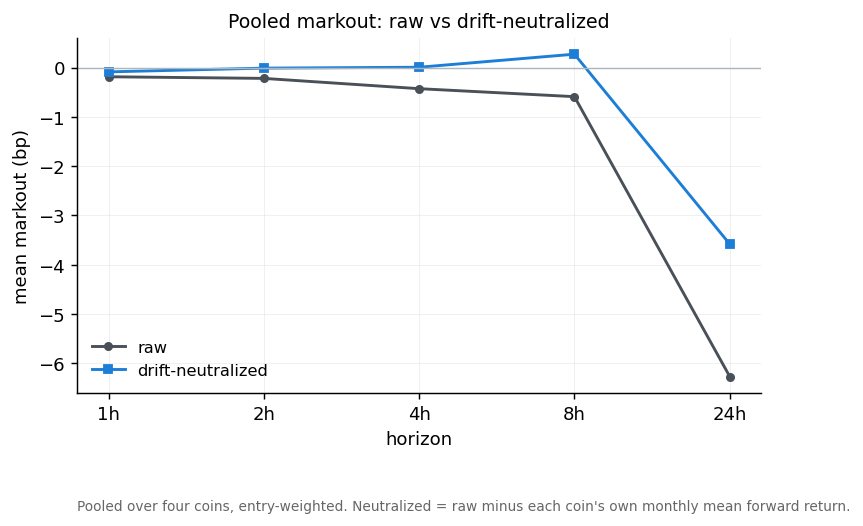

# Post-Entry Markouts of Position-Increasing Hyperliquid Taker Decisions
### Aggregate markout structure and a cross-wallet persistence experiment

## 1. Executive summary

This report measures post-entry markouts of position-increasing taker decisions on Hyperliquid (BTC, ETH, SOL, HYPE) and tests whether persistent cross-wallet differences in markout identify informed or copyable traders.

The metric is a post-fill decision markout: `direction × (close(entry + h) / close(entry) − 1)`, in basis points, both endpoints priced at the first bar strictly after the timestamp. It measures signed price movement after an entry decision. It is not realized PnL, and — with candle prices and no order-book data — it is not a full execution-quality markout.

**Scope.** Only position-increasing, taker-crossed, non-wash fills are scored; position-reducing (closing) fills are excluded from scoring. Same-bar, same-direction opening fills are aggregated into one entry at a shared price. Sub-hour execution markouts (seconds-to-minutes fill-to-mid) are unavailable; the shortest reported horizon is one hour.

**Part I.** Aggregate post-entry markout is small relative to per-entry dispersion. Pooled mean markout is within about 1 bp of zero through 8 hours and negative at 24 hours; per-coin intervals mostly include zero, and directional hit rates are near 50%. Aligned in trade direction, entries follow moves that ran *against* the eventual trade and had largely reverted by the entry bar; subsequent 8-hour markout declines as the signed pre-entry move turns from against to with the trade, with a negative fitted slope in all four coins. Larger entry notional is not associated with higher markout.

**Part II.** Static full-history wallet rankings did not generalize to the validation window. Rolling monthly ranks showed modest one-month-ahead predictive value: next-month markout rises across prior-month rank deciles, and top-decile membership recurs more often than a permutation null allows. However, the recurring cohort's returns are close to a mechanical reversal benchmark evaluated at the same timestamps, and the fade-adjusted difference is not statistically resolved. The available historical sample does not resolve an incremental return from wallet identity or direction beyond observable market state. Because the validation window informed later specification choices, Part II is exploratory; prospective data with execution measurement is required.

---

# Part I — Aggregate taker markouts

## 2. Data and methodology

**Universe and dates.** 7,332,013 taker entries from 32,949 wallets, 2025-08-01 to 2026-06-30 (UTC), restricted to BTC, ETH, SOL, HYPE.

**Cohort.** A mid-frequency taker cohort is frozen on identity, not performance: ≥200 majors fills, taker share ≥ 0.70, median round-trip hold 1–24 h, ≥200 training entries → 1,694 wallets and 812,616 priced entries.

**Observation unit.** One `(wallet, coin, bar, direction)` position-increasing taker decision. A fill is scored only if taker-crossed, non-wash, and position-increasing; maker, wash and closing fills are tracked for accounting but not scored. Same-bar same-direction opening fills aggregate to one entry; scaling across bars yields multiple entries.

**Markout and adjustment.** Horizons 1, 2, 4, 8, 24 h, priced post-fill. Raw markout is the price movement; drift-neutralized markout subtracts, per coin-month and horizon, that coin's own mean forward return (`raw − dir × monthly-drift`). Neutralization is the adjusted measure reported; a beta/market-adjusted measure is defined (subtract each entry's contemporaneous BTC return) but deferred.

**Weighting.** Term-structure and distribution results are entry-weighted; wallet results wallet-equal-weighted; persistence and decile tests wallet-day-weighted; deployability wallet-day-capped.

**Inference — calendar-day cluster bootstrap.** Confidence intervals resample the **calendar day** as the cluster: unique days are drawn independently with replacement (2,000 draws), carrying each day's wallets and coins together. This is a calendar-day cluster bootstrap, not a moving-block bootstrap; it absorbs the dependence from overlapping 8-h and 24-h forward windows and same-day cross-wallet correlation. For 24-h outcomes a 5-day block variant was checked and did not widen intervals materially. Multiplicity across wallets/metrics uses Benjamini–Hochberg FDR.

**Effective sample.** The 812,616 entries span **334 calendar days**, **1,694 wallets**, **179,402 wallet-days**, and **252,223 wallet-coin-days**. Because the resampling unit is the calendar day (≈334 clusters), intervals are wide despite the large entry count.

**Cost convention.** Cost-adjusted figures subtract an assumed 6–9 bp per-coin round-trip schedule (BTC/ETH 8, SOL 10, HYPE 14, applied as a round-trip). This schedule is a modelling assumption, not a measured or bounding cost; it omits latency slippage, size-dependent impact, funding, overlapping-capital constraints and incomplete execution.

**Splits.** Training < 2026-02-01; embargo February 2026; validation 2026-03-01 to 06-30. The validation window was examined during the study and informed later choices, so Part II validation results are exploratory.

## 3. Aggregate markout term structure

Mean markout is small and its interval is wide relative to the mean at every horizon through 8 hours; directional hit rates are near 50%.

| Coin | Horizon | Mean bp | 95% CI | Median bp | Hit rate | Std bp | N |
|---|---|--:|--:|--:|--:|--:|--:|
| BTC | 1h | −0.37 | [−1.1, +0.3] | +0.0 | 49.9% | 65 | 356,077 |
| BTC | 8h | −2.08 | [−5.7, +1.1] | +0.1 | 50.0% | 151 | 355,894 |
| BTC | 24h | −6.37 | [−12.9, −0.3] | −3.2 | 49.3% | 250 | 355,371 |
| ETH | 8h | −1.09 | [−7.7, +5.2] | +0.9 | 50.2% | 226 | 195,786 |
| ETH | 24h | −7.49 | [−20.6, +5.4] | −8.8 | 48.7% | 363 | 195,672 |
| SOL | 8h | +0.74 | [−7.1, +8.4] | +3.5 | 50.7% | 258 | 135,299 |
| HYPE | 8h | +2.96 | [−6.6, +12.9] | −0.3 | 49.9% | 332 | 125,207 |
| HYPE | 24h | −3.68 | [−27.3, +21.4] | −16.9 | 48.6% | 537 | 125,055 |
| ALL | 8h | −0.60 | [−5.4, +3.9] | +0.7 | 50.2% | 224 | 812,186 |
| ALL | 24h | −6.26 | [−16.7, +3.6] | −5.7 | 49.1% | 363 | 811,321 |

(Full 4×4 table with all horizons in Appendix A.) Only the 24-hour horizon is materially negative; its interval excludes zero for BTC. HYPE has the largest short-horizon mean, but its interval spans zero.

Splitting by trade direction, raw long and short markouts are strongly asymmetric at 24 hours (for example BTC long −23.4 vs short +17.2 bp), consistent with sample-period directional drift. After coin-month neutralization the asymmetry is materially smaller (BTC long −0.4 vs short −3.4; the largest residual asymmetry is in ETH). The 24-hour figures are therefore largely coin trend rather than entry timing.

## 4. Conditional markouts

The timing context of entries is more informative than the unconditional mean. Aligning all entries at their decision bar in trade-direction terms, the pre-entry price is *above* the entry price for longs and *below* it for shorts (about +18 to +33 bp at −8 h) and reverts toward the entry price by t = 0; post-entry the path is roughly flat to slightly negative. Entries follow moves that ran against the eventual trade direction and had largely exhausted by the entry bar.

*Reading the pre-entry axis.* The value plotted at offset τ is `dir × (close(entry + τ) / close(entry) − 1)` in bp. For a long, a positive value at τ = −8 h means the price eight hours earlier was above the entry price — price fell into the entry. For a short, a positive value means the earlier price was below the entry price — price rose into the entry. In both cases positive pre-entry values indicate the price moved *against* the eventual trade direction as it approached entry.

Conditioning subsequent 8-hour markout on the signed pre-entry move makes this explicit. Using fixed pooled-quantile bins with calendar-day cluster intervals, and a pre-specified linear slope fit on training data only, the slope is negative in every coin: BTC −0.070 [−0.154, +0.002], ETH −0.050 [−0.121, −0.000], SOL −0.051 [−0.109, −0.010], HYPE −0.068 [−0.148, −0.006]; `p(slope ≥ 0)` ≤ 0.03 in each. Subsequent markout generally declines as the pre-entry move turns from against to with the trade — consistent with short-horizon reversal exposure.

Forming notional quintiles within coin and month, larger entries do not show higher markout; equal-weighted and notional-weighted means are similar and the largest quintile is not the highest. Larger entry notional is not associated with higher subsequent decision markout in this specification. (Candle data cannot measure price impact; no impact claim is made.)

## 5. Stability, distributions and execution limitations

Mean 8-hour markout varies month to month and the panel thins and becomes BTC-heavy in later months; sparse cells should be read cautiously.

The per-entry distribution is wide and near-symmetric: at 8 hours the interquartile range is roughly ±75 to ±190 bp by coin with 10th/90th percentiles several times larger (Appendix B), so the small means sit well inside the dispersion. Markout by realized-volatility quintile and time of day is in Appendix C.

> **Execution-analysis limitation.** This report uses candle prices. A full execution-markout analysis requires actual fill price, contemporaneous midprice, spread, order-book depth and immediate price impact. With order-book data a future study would add fill-to-mid implementation shortfall; immediate markout at the seconds-to-minutes scale; spread paid; price impact versus trade size; and adverse selection versus depth. None of these is measured here; the markout reflects post-fill candle-to-candle movement only. The cost-adjusted figures likewise assume a fixed schedule and omit latency slippage, size-dependent impact, funding, overlapping-capital constraints and incomplete execution.

---

# Part II — Search for informed wallets

Aggregate markout is small relative to per-entry dispersion, but pooled estimates can conceal informed subgroups. We test whether cross-wallet differences in markout are persistent and useful for selection or copy trading.

## 6. Cross-wallet heterogeneity

Wallet-level mean markout is dispersed, but much of the spread is sampling noise: high in-sample means concentrate among wallets with fewer entries, and selecting wallets on best in-sample markout returns −28.7 bp in validation. Top in-sample wallets (Appendix D) reach +40 to +130 bp gross at 8 h; these are descriptive in-sample values, not evidence of a repeatable edge.

## 7. Static and rolling persistence

Two analyses are kept explicitly separate: a **static** full-history ranking, a **dynamic** monthly ranking, and (Section 9) a **fixed** recurring cohort.

Under static ranking, wallets are ranked once on training and measured in validation. The train-to-validation rank correlation of mean 8-hour markout is ≈ +0.02 (not significant), the highest training deciles do not retain an advantage, and a walk-forward selection across nine metrics returned a best coin p-value of 0.09 with no FDR survivors.

Under rolling ranking, wallets are re-ranked each month and evaluated one month ahead. Here a modest signal is present. Next-month markout rises across prior-month rank deciles — the relationship is a gradient across deciles, strongest in the top decile, not solely a top-decile effect — and the prior-month top decile leads the field by about +4.0 bp at 4 h and +10.3 bp at 8 h. The adjacent-month rank correlation of neutralized, wallet-day-weighted markout is +0.093 at 8 h ([+0.061, +0.126], positive in 10 of 10 folds). These estimates belong to the dynamic ranking only.

Top-decile advantage is present in most, not all, months.

Recurrence exceeds chance. Under a permutation null that preserves each month's eligible wallet set and top-decile slot count (2,000 permutations, neut_8h, 11 months), observed top-decile recurrence exceeds the null at every threshold: ≥2 months 213 vs 185.6 (p = 0.0005), ≥3 months 72 vs 35.0 (p < 0.001), ≥4 months 25 vs 5.0 (p < 0.001).

## 8. Recurring-wallet characterization

We freeze a recurring cohort as wallets in the top decile in at least two of the six training months (121 wallets), on drift-neutralized 8-hour markout with wallet-day weighting. The two-month threshold is chosen for breadth; recurrence itself is statistically supported (Section 7). What distinguishes these wallets is conviction and cross-coin breadth rather than size or activity (mean training rank percentile 0.72 vs 0.48; four coins vs three; near-identical median ticket).

Their entries occur after deeper pullbacks and larger absolute moves than other wallets or random control bars, and against the direction of the preceding move.

At the wallet level this contrarian tendency is common but not universal: 83% of the 121 have a net-contrarian entry record and 65% fade the trailing move on at least 60% of entries (Appendix D).

## 9. Benchmark, copyability and forward test

We compare high-markout wallets to a mechanical reversal benchmark (`fade_dir = −sign(trailing 8-hour move)`) evaluated at the same timestamps, so execution effects cancel in the difference. For the training-ranked top decile at 8 h, gross return is +14.0 bp ([+5.4, +22.8]) and cost-adjusted (assumed 6–9 bp schedule) +7.1 bp; the fade-adjusted difference is +1.0 bp ([−10.75, +13.66], p = 0.44). Trading in the wallet's direction did not improve on the fade at the same times. Conditioning the fade return on observable market state leaves a per-event residual of −1.3 bp ([−15.6, +13.0]) and a wallet-day-capped residual of +5.9 bp ([−5.5, +17.7]); the minimum effect this validation sample can resolve is about 11–16 bp, so a smaller incremental effect cannot be excluded but none is established. Adding wallet identity, rank, direction and size to a market-state return model changed cross-fit predictive correlation by −0.0003.

**Fixed 121-cohort — full inference.** The fixed cohort (train-only, ≥2 of 6 months) has 121 wallets; **97 were active** in validation, with **24 attrition** (no scored entries in the window). Its validation entries span 5,811 wallet-coin-days over 122 calendar days. Difference vs the field (neut_8h, wallet-coin-day weighted, calendar-day cluster bootstrap): **+10.5 bp [+5.0, +16.3], p = 0.001**; cost-adjusted **+3.5 bp**. Against the matched reversal benchmark at the same entries: **−1.1 bp [−14.1, +12.0], p = 0.572**. The field advantage concentrates in ETH (+18.4) and SOL (+16.1) versus BTC (+8.1) and HYPE (+5.0). The cohort's return is close to the mechanical fade and the fade-adjusted difference is not statistically resolved — consistent with reversal exposure rather than resolved wallet skill. This fixed-cohort estimate is distinct from the static and dynamic rankings above and remains exploratory.

A prospective test is required to separate these. It will compare, on new data under identical capital constraints and a fixed 8-hour horizon, a market-state reversal model, the same model augmented with recurring-wallet activity and direction, and direct copying of wallet direction — logging execution, spread, fees and funding.

## 10. Conclusion

Aggregate post-entry markout is small relative to per-entry dispersion through eight hours, with a negative 24-hour drift concentrated in BTC. A negative relationship is present between the signed pre-entry move and subsequent markout, consistent with short-horizon reversal exposure. Static wallet rankings did not generalize, while rolling monthly rankings showed modest one-month-ahead predictive persistence, and top-decile recurrence exceeded a permutation null. The recurring-wallet cohort was disproportionately contrarian, but the available historical sample did not statistically resolve incremental value from wallet identity or direction beyond observable market state; the estimates are consistent with a reversal exposure, and the sample cannot distinguish a small incremental wallet effect from zero. The fixed recurring cohort remains exploratory. Prospective data with actual execution measurement is required to evaluate copyability.

---

# Appendix

## A. Full markout term-structure table (calendar-day cluster 95% CI)

| Coin | Horizon | Mean bp | 95% CI | Median bp | Hit rate | Std bp | N |
|---|---|--:|--:|--:|--:|--:|--:|
| BTC | 1h | −0.37 | [−1.1, +0.3] | +0.0 | 49.9% | 65 | 356,077 |
| BTC | 4h | −1.27 | [−3.7, +0.8] | +0.2 | 50.1% | 116 | 356,030 |
| BTC | 8h | −2.08 | [−5.7, +1.1] | +0.1 | 50.0% | 151 | 355,894 |
| BTC | 24h | −6.37 | [−12.9, −0.3] | −3.2 | 49.3% | 250 | 355,371 |
| ETH | 1h | +0.00 | [−1.1, +1.2] | +0.0 | 49.9% | 95 | 195,851 |
| ETH | 4h | −0.15 | [−4.3, +4.1] | +0.3 | 50.1% | 174 | 195,839 |
| ETH | 8h | −1.09 | [−7.7, +5.2] | +0.9 | 50.2% | 226 | 195,786 |
| ETH | 24h | −7.49 | [−20.6, +5.4] | −8.8 | 48.7% | 363 | 195,672 |
| SOL | 1h | −0.42 | [−1.8, +1.0] | +0.0 | 49.9% | 109 | 135,350 |
| SOL | 4h | −0.28 | [−4.7, +4.3] | +1.5 | 50.4% | 194 | 135,344 |
| SOL | 8h | +0.74 | [−7.1, +8.4] | +3.5 | 50.7% | 258 | 135,299 |
| SOL | 24h | −6.58 | [−24.6, +9.4] | −5.4 | 49.4% | 411 | 135,223 |
| HYPE | 1h | +0.29 | [−1.5, +2.1] | +0.5 | 50.1% | 131 | 125,267 |
| HYPE | 4h | +1.35 | [−4.6, +7.2] | −1.2 | 49.7% | 240 | 125,259 |
| HYPE | 8h | +2.96 | [−6.6, +12.9] | −0.3 | 49.9% | 332 | 125,207 |
| HYPE | 24h | −3.68 | [−27.3, +21.4] | −16.9 | 48.6% | 537 | 125,055 |
| ALL | 1h | −0.19 | [−1.0, +0.6] | +0.0 | 50.0% | 93 | 812,545 |
| ALL | 4h | −0.43 | [−3.4, +2.4] | +0.3 | 50.1% | 168 | 812,472 |
| ALL | 8h | −0.60 | [−5.4, +3.9] | +0.7 | 50.2% | 224 | 812,186 |
| ALL | 24h | −6.26 | [−16.7, +3.6] | −5.7 | 49.1% | 363 | 811,321 |

## B. Trade-size and dispersion quantiles

**Trade notional ($) by coin:**

| coin | p10 | p25 | p50 | p75 | p90 | p99 |
|---|--:|--:|--:|--:|--:|--:|
| BTC | 489 | 1,237 | 4,386 | 19,762 | 94,608 | 1,549,066 |
| ETH | 440 | 1,188 | 4,306 | 20,119 | 101,699 | 1,991,700 |
| SOL | 373 | 962 | 2,906 | 11,280 | 45,930 | 499,103 |
| HYPE | 294 | 750 | 2,500 | 10,118 | 42,710 | 446,967 |

**8-hour markout dispersion by coin (bp):**

| coin | p10 | p25 | median | p75 | p90 | std |
|---|--:|--:|--:|--:|--:|--:|
| BTC | −172 | −75 | +0 | +73 | +167 | 151 |
| ETH | −258 | −107 | +1 | +106 | +249 | 226 |
| SOL | −286 | −128 | +4 | +133 | +283 | 258 |
| HYPE | −381 | −184 | −0 | +189 | +398 | 332 |

## C. Secondary conditioning and raw-vs-neutralized

## D. Wallet-level detail

Top training-decile wallets (in-sample descriptive; do not persist per Section 7):

| # | wallet | N | mean 8h (bp) | Sharpe | hit% | MDD (bp) | med $ |
|--:|---|--:|--:|--:|--:|--:|--:|
| 1 | `0x5aadb434…` | 214 | +132.8 | 0.36 | 69 | 1338 | 12,061 |
| 2 | `0xfd490cf8…` | 236 | +124.2 | 0.65 | 76 | 1676 | 131,053 |
| 3 | `0xdfb34089…` | 248 | +83.3 | 0.33 | 64 | 1400 | 5,535 |
| 4 | `0x172f5a11…` | 202 | +80.2 | 0.16 | 51 | 2917 | 3,225 |
| 5 | `0x1ecc7c22…` | 200 | +78.9 | 0.29 | 61 | 802 | 25,028 |

Per-trade Sharpe (mean/std of markout, un-annualized); MDD on a non-overlapping ≥8-hour-spaced subset.

## E. Number-to-source map (headline claims)

| Claim | Value | Script | Output |
|---|---|---|---|
| Effective sample | 334 days / 179,402 wallet-days / 252,223 wallet-coin-days | `src/verify_v4.py` | `out/v4.json` |
| Term-structure table + CI | Appendix A | `src/verify_v2.py`, inline | `out/termstructure_ci.json`, `out/core_markout_table.md` |
| Long/short raw vs neut | BTC 24h raw −23.4/+17.2, neut −0.4/−3.4 | `src/verify_v4.py` | `out/v4.json` |
| Event study | pre-entry +18 to +33 bp | `src/pi_compute.py` | `out/eventstudy.json` |
| Conditional training slope | −0.05 to −0.07 /bp, p(≥0) ≤ 0.03 | `src/verify_v4.py` | `out/v4.json` |
| Size within coin-month | no increase with size | `src/verify_v4.py` | `out/v4.json` |
| Static rank correlation | ≈ +0.02 (n.s.) | `src/fig_v4.py` | `out/cohort_K_entries.parquet` |
| Rolling rank IC / decile lead | +0.093 [+0.061,+0.126]; +4.0@4h / +10.3@8h | `src/cohort_M2_recurrence.py`, `src/verify_v4.py` | `out/v4.json` |
| Recurrence permutation null | ≥2 p=0.0005, ≥3 / ≥4 p<0.001 | `src/verify_v4.py` | `out/v4.json` |
| Fixed-121 validation | +10.5 [+5.0,+16.3] p=0.001; cost-adj +3.5; fade-adj −1.1 [−14.1,+12.0] p=0.572 | `src/verify_v4.py` | `out/v4.json` |
| Top-decile gross / cost-adj / fade-adj | +14.0 [+5.4,+22.8] / +7.1 / +1.0 [−10.75,+13.66] p=0.44 | `src/cohort_M2_deploy.py` | ledger M2-deploy |
| Market-state residual + MDE | −1.3 [−15.6,+13.0] / +5.9 [−5.5,+17.7]; MDE 11–16 | `src/cohort_M4_residual.py` | ledger M4 |
| Nested incremental IC | −0.0003 | `src/cohort_P2_freeze_models.py` | `out/cohort_P2_models.npz` |

## F. Corrections from prior drafts
Verification of the load-bearing claims (pre-entry sign convention, long/short asymmetry, conditional-slope test, size specification, permutation recurrence null, full fixed-121 inference, cost terminology, bootstrap definition) is documented with before/after values in `docs/FINAL_AUDIT_NOTE.md`. Earlier study corrections (selection leakage, matched controls, a degenerate shrinkage estimator, positive-control power) are in `docs/CHANGELOG_v2.md` and `docs/FINDINGS_LEDGER.md`.
