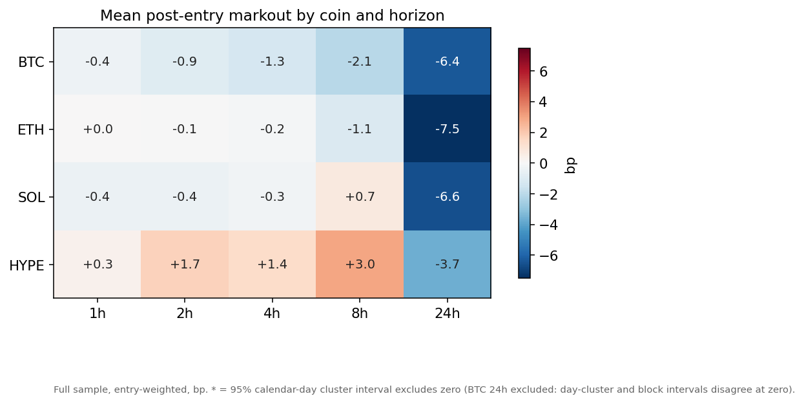
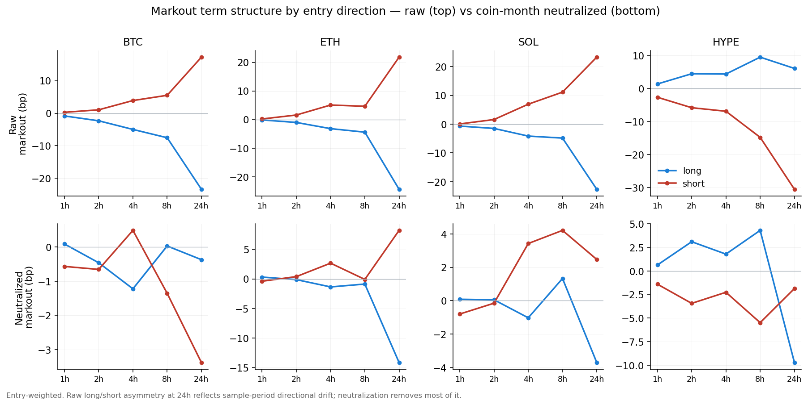
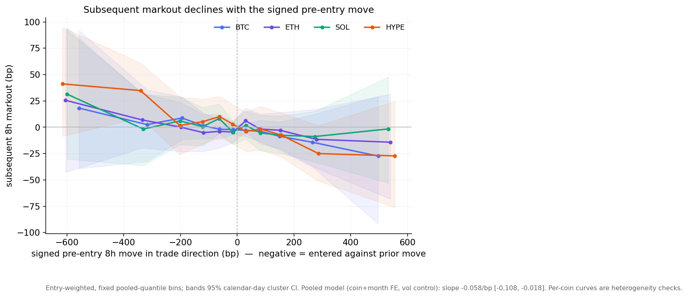
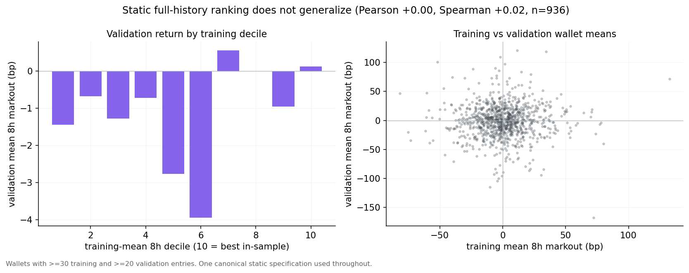
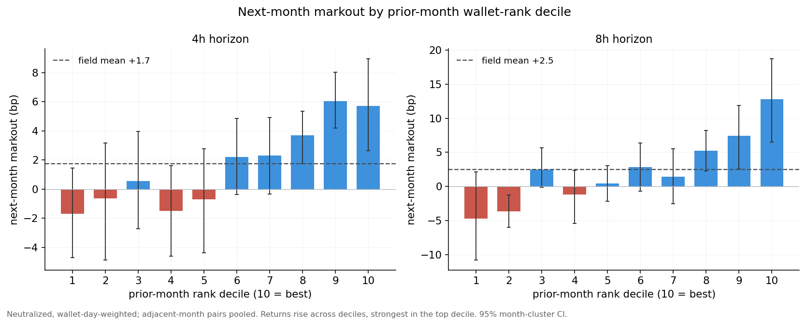
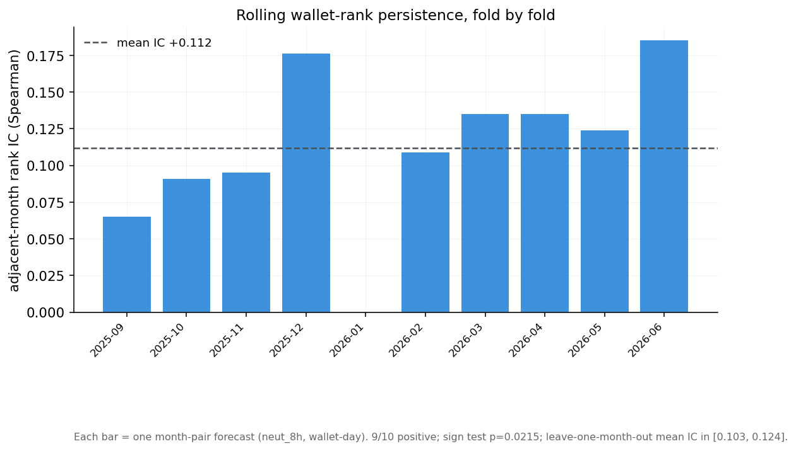
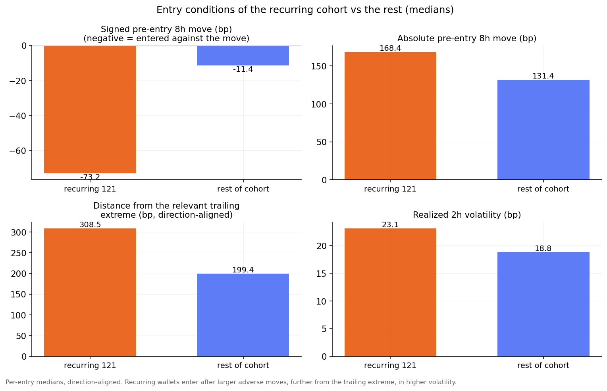
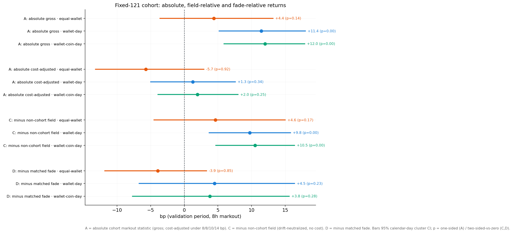
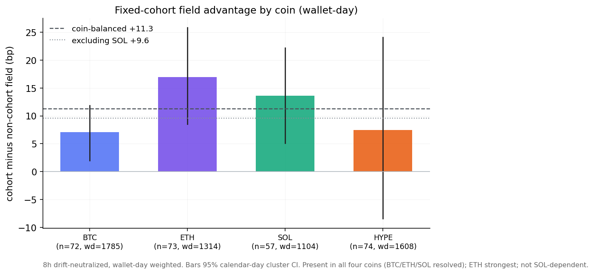
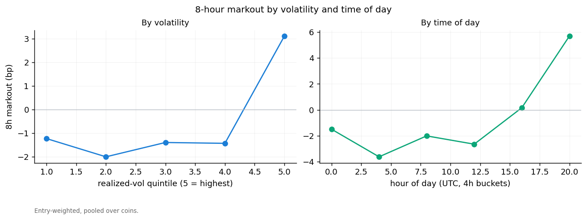

## 1. Executive summary

This report measures post-entry markouts of position-increasing taker decisions on Hyperliquid (BTC, ETH, SOL, HYPE) and asks whether persistent cross-wallet differences in markout identify informed or copyable traders. The metric is a post-fill decision markout, `direction × (close(entry + h) / close(entry) − 1)` in basis points, priced at the first bar strictly after the timestamp. It is a signed price move after a decision — not realized PnL, and, with candle prices and no order-book data, not a full execution-quality markout. Only position-increasing, taker-crossed, non-wash fills are scored; closing fills are excluded from scoring; same-bar same-direction opening fills are aggregated; sub-hour execution markouts are unavailable and the shortest horizon is one hour.

Four distinct objects are reported and should not be conflated:

1. **Unconditional aggregate markout** is near zero through eight hours and highly dispersed; per-coin intervals mostly include zero and directional hit rates are near 50%.
2. **Dynamic monthly wallet ranking** shows modest next-month persistence: next-month markout rises across prior-month rank deciles (mean adjacent-month rank IC +0.11, positive in 9 of 10 folds, sign test p = 0.02), and top-decile membership recurs more often than a permutation null over the training window.
3. A **training-defined recurring cohort** (121 wallets) shows positive field-relative markout under activity-weighted estimators (wallet-day +9.8 bp, p = 0.002) but the effect is weaker and unresolved under equal-wallet weighting (+4.6 bp, p = 0.17). This suggests the effect is concentrated in more active wallet-days rather than broadly established across all selected wallets.
4. **Benchmark-adjusted and absolute value.** The cohort does not show a statistically resolved return over a matched mechanical reversal benchmark at the same timestamps, and its absolute return after the assumed cost schedule is not resolved above zero under any weighting. Positive absolute profitability is therefore not established.

Aggregate post-entry markout is near zero through eight hours and highly dispersed. Entries are, on average, contrarian — placed after moves that ran against the eventual trade direction — and subsequent markout declines with the pre-entry return (pooled slope −0.058 bp per bp, 95% CI [−0.108, −0.018]). The findings are consistent with persistent exposure to favorable reversal conditions but do not yet establish broadly distributed wallet-level skill or a deployable copy-trading strategy. Because the validation window informed later specification choices, Part II is exploratory; a prospective test with execution measurement is required.

---

# Part I — Aggregate taker markouts

## 2. Data and methodology

**Universe.** 7,332,013 taker entries from 32,949 wallets, 2025-08-01 to 2026-06-30 (UTC), restricted to BTC, ETH, SOL, HYPE. A mid-frequency cohort is frozen on identity, not performance (≥200 majors fills, taker share ≥ 0.70, median round-trip hold 1–24 h, ≥200 training entries): 1,694 wallets, 812,616 priced entries.

**Eligibility windows.** Of the four eligibility variables, the training-entry count is training-scoped, but the majors-fill count, taker share and median hold were computed over the whole window. Recomputing them training-only, 1,557 of 1,694 wallets (91.9%) still qualify; the cohort is therefore predominantly training-defined rather than cleanly historical. The leak does not change the conclusions: the recurring cohort restricted to its 108 training-clean members gives the same field-relative result (§9). Details in the companion technical appendix.

**Observation unit.** One `(wallet, coin, bar, direction)` position-increasing taker decision. Maker, wash and closing fills are tracked for position accounting but not scored. Same-bar same-direction opening fills aggregate to one entry; scaling across bars yields multiple entries.

**Markout and adjustment.** Horizons 1, 2, 4, 8, 24 h, priced post-fill. Raw markout is the price move; drift-neutralized markout subtracts, per coin-month and horizon, that coin's own mean forward return. Neutralization is the adjusted measure reported; a beta/market-adjusted measure is defined but deferred.

**Cost schedule (canonical).** All cost-adjusted figures use one table — **BTC 8, ETH 8, SOL 10, HYPE 14 bp round-trip** — applied per scored entry (one round-trip charge per decision, conservative for a one-way markout). The schedule is a modelling assumption, not a bound; it excludes latency slippage, size-dependent impact, funding, partial execution and overlapping-capital constraints. Results are reported as "cost-adjusted under the assumed schedule," never as "net."

**Weighting and portfolio rule.** Term-structure and distribution results are entry-weighted; persistence and decile tests wallet-day-weighted; the fixed cohort is reported under three weightings (§9). The wallet-day and wallet-coin-day estimators average per-decision markouts (equal weight within a cell, equal weight per cell, cost per entry); they impose no capital constraint and do not net overlapping 8-hour positions. Absolute figures are therefore average cost-adjusted markout statistics per decision, not returns on bounded capital; the portfolio rule and its limits are stated in the companion technical appendix.

**Inference.** Confidence intervals use a **calendar-day cluster bootstrap** (unique days drawn independently with replacement, 2,000 draws, wallets and coins carried with their day). Calendar-day clustering preserves contemporaneous dependence across wallets and coins; it does **not** preserve serial dependence across adjacent days. A **moving-block bootstrap** (overlapping candidate blocks of fixed length over the ordered days, last block truncated to fill exactly N days, cohort and field resampled jointly) addresses serial dependence and is reported for 24-hour outcomes and for the fixed-cohort result. Multiplicity uses Benjamini–Hochberg FDR.

**Effective sample.** The 812,616 entries span 334 calendar days, 1,694 wallets, 179,402 wallet-days and 252,223 wallet-coin-days. Because the resampling unit is the calendar day (≈334 clusters), intervals are wide despite the large entry count.

**Splits.** Training < 2026-02-01; embargo February 2026; validation 2026-03-01 to 06-30. The validation window was examined during the study, so Part II validation results are exploratory.

## 3. Aggregate markout term structure

Mean markout is small and its interval is wide relative to the mean at every horizon through 8 hours; hit rates are near 50%.

| Coin | Horizon | Mean bp | 95% CI | Median bp | Hit rate | Std bp | N |
|---|---|--:|--:|--:|--:|--:|--:|
| BTC | 1h | −0.37 | [−1.1, +0.3] | +0.0 | 49.9% | 65 | 356,077 |
| BTC | 8h | −2.08 | [−5.7, +1.1] | +0.1 | 50.0% | 151 | 355,894 |
| BTC | 24h | −6.37 | [−13.5, 0.0]† | −3.2 | 49.3% | 250 | 355,371 |
| ETH | 8h | −1.09 | [−7.7, +5.2] | +0.9 | 50.2% | 226 | 195,786 |
| SOL | 8h | +0.74 | [−7.1, +8.4] | +3.5 | 50.7% | 258 | 135,299 |
| HYPE | 8h | +2.96 | [−6.6, +12.9] | −0.3 | 49.9% | 332 | 125,207 |
| ALL | 8h | −0.60 | [−5.4, +3.9] | +0.7 | 50.2% | 224 | 812,186 |
| ALL | 24h | −6.26 | [−16.5, +3.4] | −5.7 | 49.1% | 363 | 811,321 |

†BTC 24h is the only horizon whose interval approaches zero; the 5-day moving-block interval is [−13.0, +0.1], so it is marginal rather than resolved. (Full 4×4 table in the appendix.)

{width=78%}

Raw long and short markouts are strongly asymmetric at 24 hours (BTC long −23.4 vs short +17.2 bp), consistent with sample-period directional drift; after coin-month neutralization the asymmetry is materially smaller (BTC −0.4 vs −3.4, largest residual in ETH). The 24-hour figures are largely coin trend rather than entry timing.

{width=98%}

## 4. Conditional markouts

Aligning entries at their decision bar in trade-direction terms, the pre-entry price is above the entry price for longs and below it for shorts (about +18 to +33 bp at −8 h) and returns to the entry price by construction at t = 0. The event study establishes only that **prices tended to move against the eventual trade direction before entry**; because the curve is normalized to the entry price it cannot, on its own, establish exhaustion.

{width=82%}

Two distinct pre-entry quantities appear in this report and are named separately.

- **Event-study ordinate** — *earlier price relative to entry, aligned in trade direction*: `E_t = dir × (close(entry+t)/close(entry) − 1)` for t < 0 (the quantity plotted above). A positive value means the price subsequently moved against the eventual trade direction into entry. *Example:* a long whose price was 30 bp higher eight hours before entry than at entry has `E_{−8h} = +30` bp — price fell 30 bp into the entry.
- **Pre-entry return in trade direction** — the conditional-regression regressor: `R_pre = dir × (close(entry)/close(entry−8h) − 1)`. A negative value means the wallet entered against the preceding move. *Example:* a short that opened after price rose 30 bp over the prior eight hours has `R_pre = −30` bp — it entered against a rally.

Conditioning subsequent 8-hour markout on the pre-entry return in trade direction, a pooled model (`markout ~ pre-entry return + coin fixed effects + month fixed effects + realized volatility`, day-cluster bootstrap, n = 590,910) gives a slope of **−0.058 bp per bp, 95% CI [−0.108, −0.018]** (two-sided interval excludes zero). Per-coin slopes are all negative and are shown as heterogeneity checks; their one-sided tests of H0: β ≥ 0 are each below 0.05, but with four coin tests and the widest uncertainty on BTC we do not claim each coin is individually established. Subsequent markout generally declines as the pre-entry return turns from against to with the trade — consistent with short-horizon reversal exposure.

{width=80%}

Forming notional quintiles within coin and month, larger entries do not show higher markout; equal-weighted and notional-weighted means are similar and the largest quintile is not the highest. Larger entry notional is not associated with higher subsequent decision markout in this specification. (Candle data cannot measure price impact; no impact claim is made.)

{width=92%}

## 5. Stability, distributions and execution limitations

Mean 8-hour markout varies month to month and the panel thins and becomes BTC-heavy in later months.

{width=90%}

The per-entry distribution is wide and near-symmetric: at 8 hours the interquartile range is roughly ±75 to ±190 bp by coin, so the small means sit well inside the dispersion (appendix). Markout by realized-volatility quintile and time of day is in the appendix.

**Execution-analysis limitation.** This report uses candle prices. A full execution-markout analysis requires actual fill price, contemporaneous midprice, spread, order-book depth and immediate price impact. With order-book data a future study would add fill-to-mid implementation shortfall, immediate markout at the seconds-to-minutes scale, spread paid, price impact versus trade size, and adverse selection versus depth. None is measured here; the markout reflects post-fill candle-to-candle movement only, and cost-adjusted figures assume the fixed schedule above.

---

# Part II — Search for informed wallets

Aggregate markout is small relative to per-entry dispersion, but pooled estimates can conceal informed subgroups. We test whether cross-wallet differences are persistent and useful for selection or copy trading. Three wallet objects are kept explicitly separate: a **static** full-history ranking, a **dynamic** monthly ranking, and a **fixed** recurring cohort.

## 6. Cross-wallet heterogeneity

Wallet-level mean markout is dispersed, but much of the spread is sampling noise: high in-sample means concentrate among wallets with fewer entries, and selecting wallets on best in-sample markout returns −28.7 bp in validation. Top in-sample wallets (appendix) reach +40 to +130 bp gross at 8 h — descriptive in-sample values, not evidence of a repeatable edge.

## 7. Static and rolling persistence

Under **static** ranking (one canonical specification: wallets with ≥30 training and ≥20 validation entries, raw 8-hour wallet means, n = 936), the training-to-validation correlation is Pearson +0.00 / Spearman +0.02 — no generalization. The highest training deciles do not retain an advantage, and a walk-forward selection across nine metrics returned a best coin p-value of 0.09 with no FDR survivors.

{width=98%}

Under **dynamic** monthly ranking, next-month markout rises across prior-month rank deciles — a gradient, strongest in the top decile, not solely a top-decile effect. Treating calendar time as the independent dimension, the adjacent-month rank IC (neutralized, wallet-day-weighted) is positive in **9 of 10 folds** (mean +0.11, median +0.12, sd 0.05, sign test p = 0.02); leave-one-month-out mean IC stays in [+0.10, +0.12], and the decile gradient survives leave-one-month-out. With ten folds this is suggestive rather than tightly resolved, and it speaks to rank ordering, not to profitability.

{width=98%}

{width=90%}

**Recurrence.** Over the six training months (the only window that may justify the cohort construction), top-decile membership recurs more than a permutation null preserving each month's eligible set and slot count allows: ≥2 months 121 vs 88.7, ≥3 months 27 vs 8.3, ≥4 months 5 vs 0.5 (all p < 0.001). The same test over all 11 months agrees but overlaps the validation window and is exploratory only. This establishes only that monthly top-decile membership recurs more often than random reassignment among eligible wallets; it does not establish private information, profitability, unique skill, incremental value over reversal, or that two appearances is a uniquely correct boundary. The ≥2-month threshold is an operational choice to retain enough wallets for characterization and forward testing.

## 8. Recurring-wallet characterization

We freeze a recurring cohort as wallets in the top decile in at least two of the six training months (121 wallets), on drift-neutralized 8-hour markout with wallet-day weighting. Recurrence itself is statistically supported (§7). These wallets are distinguished by conviction and cross-coin breadth, not size or activity (mean training rank percentile 0.72 vs 0.48; four coins vs three; near-identical median ticket).

Their entries occur after larger adverse moves, further from the relevant trailing extreme, and in higher volatility than the rest of the cohort. Each variable is measured per entry and summarized two ways — entry-weighted (below) and equal-wallet (each wallet's own median first). Both agree. Direction-aligned medians, recurring 121 vs rest of cohort: pre-entry return in trade direction −81 vs −9 bp; absolute pre-entry 8-hour move 178 vs 133 bp; distance from the relevant trailing extreme (trailing 24-hour window; for a long, distance below the trailing high; for a short, distance above the trailing low; positive bp) 314 vs 196 bp; realized 2-hour volatility 23 vs 19 bp.

{width=92%}

At the wallet level this contrarian tendency is common but not universal: 83% of the 121 have a net-contrarian entry record and 65% fade the trailing move on at least 60% of entries (appendix).

## 9. Benchmark, copyability and the fixed cohort

We compare high-markout wallets to a mechanical reversal benchmark (`fade = −sign(trailing 8-hour move)`) at the same timestamps. In this difference the coin, timestamp, horizon, pricing convention and assumed symmetric costs are matched; actual execution need not cancel, because wallet-copying and the fade may trade opposite sides of the book and face different spread, depth, slippage and impact — no order-book-based execution claim is made. For the training-ranked top decile at 8 h, gross return is +14.0 bp ([+5.4, +22.8]) and cost-adjusted +7.1 bp; the fade-adjusted difference is +1.0 bp ([−10.8, +13.7], p = 0.44). Trading in the wallet's direction did not improve on the fade. Conditioning the fade return on observable market state leaves a per-event residual of −1.3 bp ([−15.6, +13.0]) and a wallet-day-capped residual of +5.9 bp ([−5.5, +17.7]); the minimum effect this validation sample can resolve is about 11–16 bp, so a smaller incremental effect cannot be excluded but none is established.

**Fixed 121-cohort — two questions, four estimands.** Equal-wallet weighting answers *are the selected wallets generally better than other wallets?*; wallet-day weighting answers *would following the cohort's observed wallet-days beat the comparable field?* (wallet-day and wallet-coin-day are related activity-weighted estimators, not independent confirmations). The cohort has 121 wallets; 97 active in validation (24 attrition), 4,286 wallet-days over 122 calendar days. A = absolute cohort markout statistic (§2 — not a capital-constrained return); B = minus non-cohort field (drift-neutralized, no cost); C = minus matched fade.

| Estimand | Equal-wallet | Wallet-day | Wallet-coin-day |
|---|--:|--:|--:|
| A. Absolute gross, p(>0) | +4.4 [−3.6,13.2] p=.15 | +11.4 [5.2,18.0] p=.001 | +12.0 [5.9,17.9] p<.001 |
| A. Absolute cost-adjusted, p(>0) | −5.7 [−13.2,2.9] p=.92 | +1.3 [−5.0,7.6] p=.34 | +2.0 [−3.9,8.0] p=.25 |
| B. Minus non-cohort field | +4.6 [−4.5,15.0] p=.17 | +9.8 [3.7,15.8] p=.002 | +10.5 [4.7,16.4] p=.001 |
| C. Minus matched fade | −3.9 [−11.8,3.3] p=.85 | +4.5 [−6.7,16.4] p=.23 | +3.8 [−7.7,15.6] p=.29 |

{width=86%}

The field-relative advantage (B) is resolved under the activity-weighted estimators (+9.8 / +10.5, p ≤ 0.002) but weaker and unresolved under equal-wallet (+4.6, p = 0.17), indicating the effect is concentrated in more active wallet-days rather than broadly established across all selected wallets. The **absolute cost-adjusted return is not resolved above zero under any weighting** (p = 0.34 / 0.92 / 0.25), so positive profitability after assumed costs is not established. The value over the matched fade (C) is not resolved under any weighting. The result is robust to the eligibility leak (clean 108-wallet subset: B wallet-day +11.1 [+4.3, +17.5], p < 0.001) and to serial dependence (wallet-day B: day-cluster +9.8 p = 0.001; 7-day moving-block +9.8 p = 0.006; 5-day moving-block +9.8 p = 0.004 — the daily p = 0.001 is mildly optimistic). By month it is +18.0 / +10.3 / **−8.2** / +19.2 (Mar–Jun); leave-one-month-out B is positive in every case (+6.6 to +15.7).

Across coins the field advantage is broad, not SOL-specific: B is +7.1 [2.0,11.9] (BTC), +17.0 [8.5,25.8] (ETH), +13.6 [5.1,22.2] (SOL) and +7.5 [−8.4,24.1] (HYPE); the coin-balanced estimate is +11.3 bp and excluding SOL it is +9.6 bp. The pattern is a broad wallet-quality-versus-field difference, strongest in ETH, not a single-coin artifact.

{width=82%}

A prospective test is required to separate reversal exposure from wallet skill: on new data, under a defined capital rule and a fixed 8-hour horizon, compare a market-state reversal model, the same model augmented with recurring-wallet activity and direction, and direct copying of wallet direction — logging execution, spread, fees and funding.

## 10. Conclusion

Aggregate post-entry markout is near zero through eight hours and highly dispersed, with a marginal negative 24-hour drift concentrated in BTC. A negative relationship is present between the pre-entry return in trade direction and subsequent markout, consistent with short-horizon reversal exposure.

Wallet rankings exhibit modest next-month persistence, and a training-defined recurring cohort shows positive field-relative markout under activity-weighted estimators. The result is weaker under equal-wallet weighting and appears concentrated in particular wallet-days. The recurring cohort does not show a statistically resolved incremental return over a matched mechanical reversal benchmark, and positive absolute performance after assumed costs is not established without further inference. These findings are consistent with persistent exposure to favorable reversal conditions but do not yet establish broadly distributed wallet-level skill or a deployable copy-trading strategy. Because the validation window informed specification choices, the fixed cohort remains exploratory, and prospective data with actual execution measurement is required to evaluate copyability.

---

# Appendix

## A. Full markout term-structure table (calendar-day cluster 95% CI)

| Coin | Horizon | Mean bp | 95% CI | Median bp | Hit rate | Std bp | N |
|---|---|--:|--:|--:|--:|--:|--:|
| BTC | 1h | −0.37 | [−1.1, +0.3] | +0.0 | 49.9% | 65 | 356,077 |
| BTC | 4h | −1.27 | [−3.7, +0.8] | +0.2 | 50.1% | 116 | 356,030 |
| BTC | 8h | −2.08 | [−5.7, +1.1] | +0.1 | 50.0% | 151 | 355,894 |
| BTC | 24h | −6.37 | [−13.5, 0.0] | −3.2 | 49.3% | 250 | 355,371 |
| ETH | 1h | +0.00 | [−1.1, +1.2] | +0.0 | 49.9% | 95 | 195,851 |
| ETH | 4h | −0.15 | [−4.3, +4.1] | +0.3 | 50.1% | 174 | 195,839 |
| ETH | 8h | −1.09 | [−7.7, +5.2] | +0.9 | 50.2% | 226 | 195,786 |
| ETH | 24h | −7.49 | [−20.6, +5.4] | −8.8 | 48.7% | 363 | 195,672 |
| SOL | 1h | −0.42 | [−1.8, +1.0] | +0.0 | 49.9% | 109 | 135,350 |
| SOL | 4h | −0.28 | [−4.7, +4.3] | +1.5 | 50.4% | 194 | 135,344 |
| SOL | 8h | +0.74 | [−7.1, +8.4] | +3.5 | 50.7% | 258 | 135,299 |
| SOL | 24h | −6.58 | [−24.6, +9.4] | −5.4 | 49.4% | 411 | 135,223 |
| HYPE | 1h | +0.29 | [−1.5, +2.1] | +0.5 | 50.1% | 131 | 125,267 |
| HYPE | 4h | +1.35 | [−4.6, +7.2] | −1.2 | 49.7% | 240 | 125,259 |
| HYPE | 8h | +2.96 | [−6.6, +12.9] | −0.3 | 49.9% | 332 | 125,207 |
| HYPE | 24h | −3.68 | [−27.3, +21.4] | −16.9 | 48.6% | 537 | 125,055 |
| ALL | 8h | −0.60 | [−5.4, +3.9] | +0.7 | 50.2% | 224 | 812,186 |
| ALL | 24h | −6.26 | [−16.5, +3.4] | −5.7 | 49.1% | 363 | 811,321 |

## B. Trade-size and dispersion quantiles

Trade notional ($): BTC median 4,386 (p90 94,608); ETH 4,306 (101,699); SOL 2,906 (45,930); HYPE 2,500 (42,710). 8-hour markout dispersion (bp, p10 / median / p90 / std): BTC −172 / +0 / +167 / 151; ETH −258 / +1 / +249 / 226; SOL −286 / +4 / +283 / 258; HYPE −381 / −0 / +398 / 332.

{width=70%}

## C. Secondary conditioning and raw-vs-neutralized

{width=88%}

{width=72%}

{width=72%}

## D. Wallet-level detail

{width=72%}

Top training-decile wallets (in-sample descriptive; do not persist per §7):

| # | wallet | N | mean 8h (bp) | Sharpe | hit% | med $ |
|--:|---|--:|--:|--:|--:|--:|
| 1 | 0x5aadb434… | 214 | +132.8 | 0.36 | 69 | 12,061 |
| 2 | 0xfd490cf8… | 236 | +124.2 | 0.65 | 76 | 131,053 |
| 3 | 0xdfb34089… | 248 | +83.3 | 0.33 | 64 | 5,535 |
| 4 | 0x172f5a11… | 202 | +80.2 | 0.16 | 51 | 3,225 |
| 5 | 0x1ecc7c22… | 200 | +78.9 | 0.29 | 61 | 25,028 |

Per-trade Sharpe (mean/std of markout, un-annualized).

A companion technical appendix documents the audit trail, the number-to-source mapping and the reproducibility package.
