# Informed Flow on Hyperliquid
### Markout analysis of the full perp tape
*Aug 2025 – Jun 2026 · 11 months · ~555k taker wallets · 202 standard perp markets*

---

## Summary

We ranked wallets by markout PnL and tested whether their positive markout is persistent out of sample. We found that out of sample test shows markout PnL rankings do not select traders whose edge persists on average. Statistically there will be a cohort that looks good as a result of luck, and an even smaller cohort that continues to persist out of sample purely by luck. How can we isolate the truly informed traders from the lucky ones? 

Using a certification statistic we find **57 wallets whose records are too consistent for luck** (a dependence-preserving null expects ~15), deduplicating to **43 independent traders**. With only 11 months of data we can not isolate the the ~15 lucky from the skilled traders. 

---

## 1. Data and Filter 

The tape is Hyperliquid's complete fills archive, which consists of all trades on all hip3 markets.

After removing liquidation trades and TWAP trades, we were left with ~55k taker wallets.

From there we applied a filter:

150–20,000 orders, ≥25 active days, 0.5–15 orders/day, ≥$500 mean order  

This leaves ~23k remaining wallets

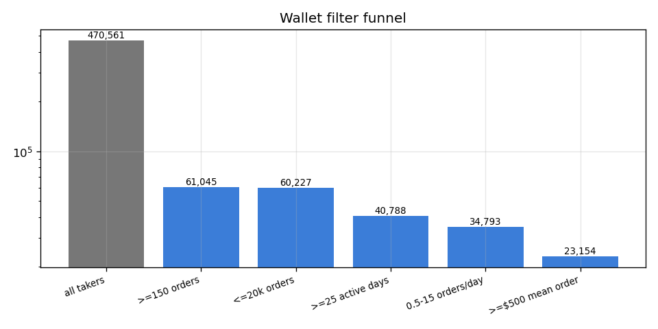

*The remaining population.*

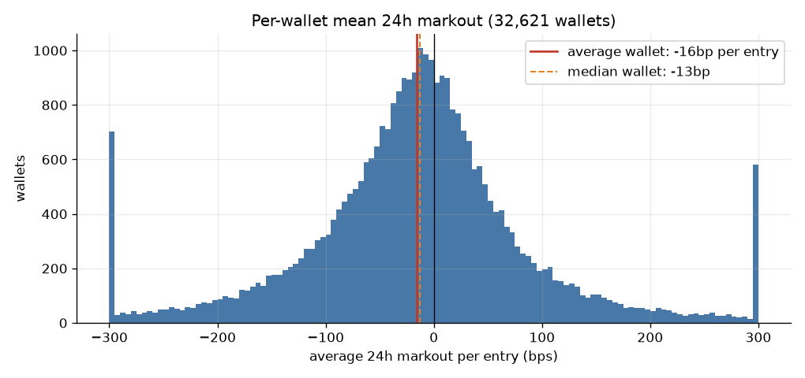

*The mean eligible wallet **loses ~16bp
per entry** over the following 24h (median −13bp).* 

## 3. Markout by market and horizon

Mean markout at nine horizons (1h to 168h) for each major market and the alt aggregate:

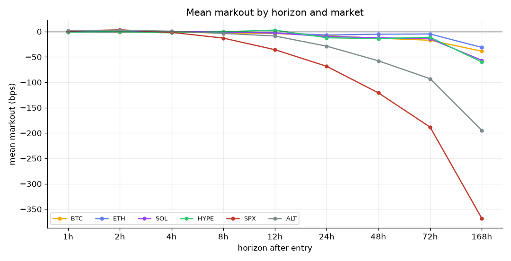

Ranking wallets by total markout PnL at the 24h horizon:

| # | wallet | markout PnL (USD) | entries | mean bps | hit rate |
|---|---|---|---|---|---|
| 1 | `0xa6ee1ed1ae80b8352603654b39f5e7b9bedd5078` | 19,190,482 | 148,090 | +65.2 | 52% |
| 2 | `0xace0a4c087f7f199328fb1e38d8d27bd237b03fd` | 7,623,090 | 82,919 | -3.5 | 53% |
| 3 | `0x7f55a0b28ba031dc08c1fdf7336a74e399b840d1` | 5,266,857 | 31,492 | +12.5 | 51% |
| 4 | `0x15a4f009bb324a3fb9e36137136b201e3fe0dfdb` | 4,991,422 | 22,887 | +73.6 | 48% |
| 5 | `0x0ddf9bae2af4b874b96d287a5ad42eb47138a902` | 4,656,762 | 62,170 | +17.8 | 43% |
| 6 | `0x960bb18454cd67b5a3edb4fa802b7c0b5b10e2ee` | 4,578,628 | 113,828 | -0.6 | 49% |
| 7 | `0x06bc596fb16734f7abc3a5996b580be932c2fb72` | 3,632,636 | 75,363 | +13.6 | 57% |
| 8 | `0xe9c888b87f2c8723a08d105a18bcd5cbb101770f` | 3,571,082 | 25,703 | +200.2 | 56% |
| 9 | `0x72655b3926db3afbe914a53b0604905af7ce11a5` | 3,495,078 | 10,443 | +237.5 | — |
| 10 | `0x922c8fa6bafbc4251f9ea8ced4ae342326d57fad` | 3,042,149 | 13,212 | +72.6 | 49% |

*(Hit rates are position-level at 24h.* 

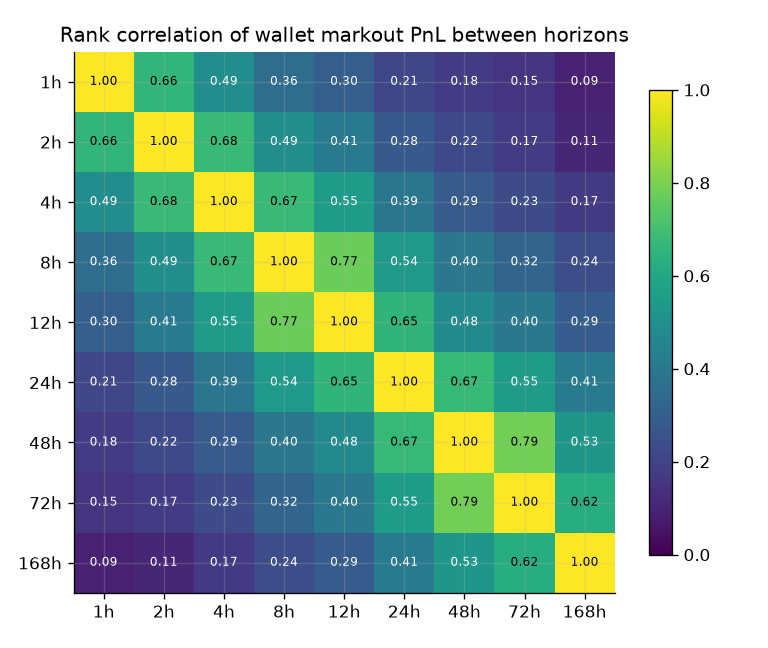

past markout PnL regresses hard toward zero:

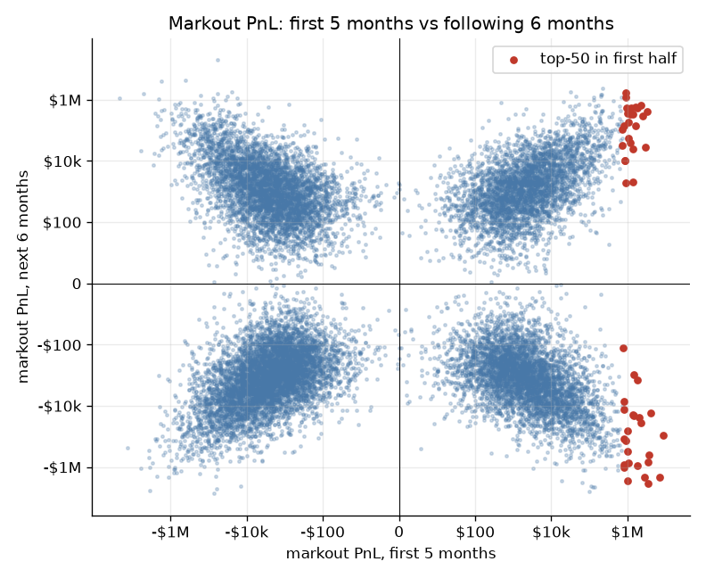

## 4. Out-of-sample test

| test | result | bar | verdict |
|---|---|---|---|
| markout of the top-50 vs 1,000 random groups | 84.5th percentile | 97.5th | **FAIL** |
| copy simulation (spread, fees, funding) | Sharpe −0.03 | CI > 0 | **FAIL** |
| month-by-month walk-forward | 3/5 months, z +0.37 | 4/5 and z > 1.64 | **FAIL** |

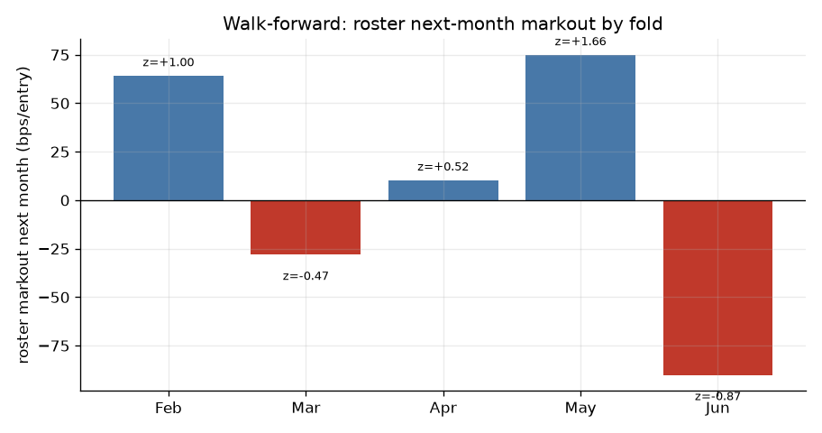

*The ranking works in some months and loses badly in others (June: −90bp/entry). It is not
selecting persistent skill.*

## 5. Separating informed traders from lucky ones

We score each wallet with a t-statistic that handles 3 problems: 

1. A rising month makes every long look informed. To address this we is scored each entry against its own coin's monthly average.
2. A trader that places 40 orders to buy ETH in a window is not betting 40 times but rather doubling down on an existing opinion of the market. We aggregated these orders into one position.
3. Positions across coins are correlated bets on the market, which inflates significance. To address this, each wallet is compared against its own record with directions randomly flipped week by week. The flipped version keeps all the correlation and fat tails but has no skill, so whatever beats it is skill.

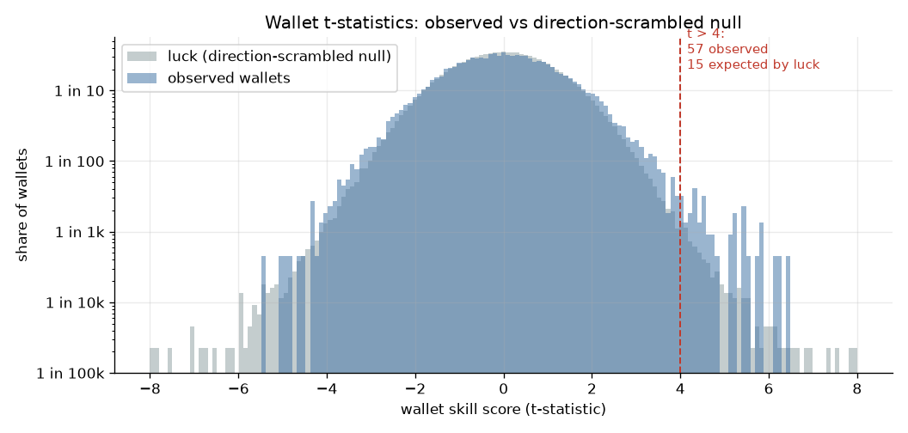

*Grey is the flipped (luck-only) world; blue is reality. Above a score of 4 there are 57 wallets. Luck would expect ~15. We can infer that about 40 of the 57 are genuinely informed.*

Some of the 57 are the same trader. Comparing entry timing, coin overlap, and PnL correlation across all pairs merges them into **43 independent traders** — including one group of 8 wallets placing the same trades within minutes of each other:

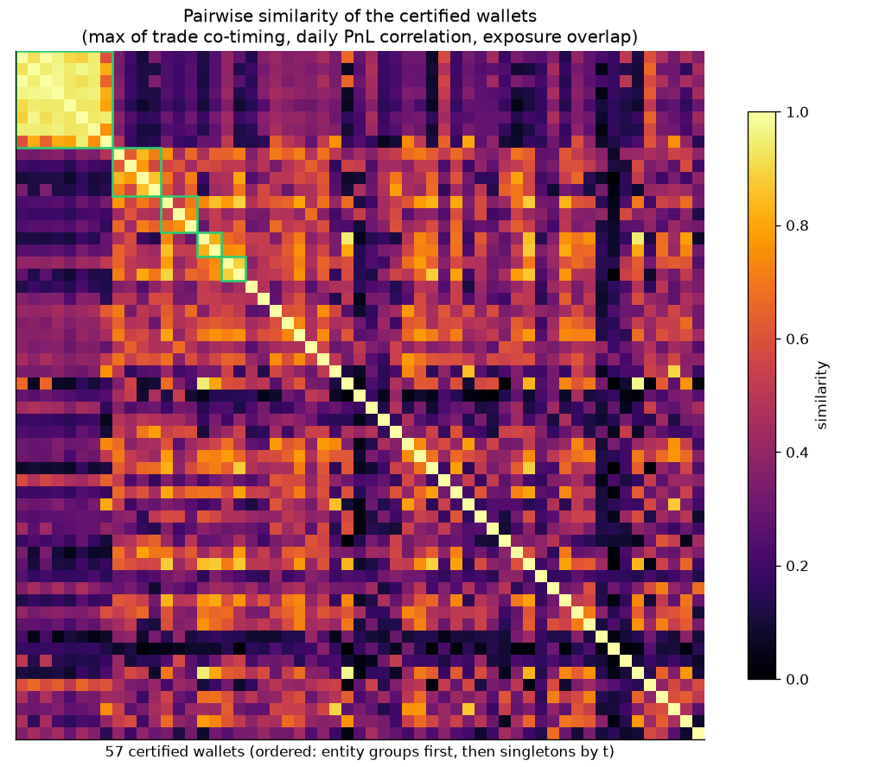

*Each pixel is a measured similarity between two wallets. Green boxes mark the merged
groups; the bright block is the 8-wallet group.*

The top of the certified list:

| # | wallet | t | positions | mean timing bps | hit rate | momentum share | long share | entity group |
|---|---|---|---|---|---|---|---|---|
| 1 | `0x10430387079cd877e4759f7af34779bdccfd1e2f` | 6.40 | 560 | +137.0 | 53% | 21% | 91% | group 1 |
| 2 | `0x4248a0b77cd31099ac91ff479e4b7be9b2f477ed` | 6.25 | 362 | +215.4 | 58% | 15% | 68% | — |
| 3 | `0xaa04e410add2d662e33cbdfbb5320764d39b1486` | 6.17 | 698 | +128.1 | 59% | 11% | 53% | group 2 |
| 4 | `0x54a2f1feae0567a3006eaea0d02d766b0851e192` | 5.85 | 168 | +243.7 | 63% | 10% | 96% | — |
| 5 | `0x1eb39d46c9814c8f16ea657d9dc1029575f4d651` | 5.82 | 594 | +120.9 | 61% | 26% | 36% | — |
| 6 | `0x8533969c2936444c79e352b0784873ebda60b14b` | 5.79 | 642 | +142.1 | 59% | 30% | 53% | — |
| 7 | `0x97be9c7904f9c772a3efbf9e10286b91ba8a773e` | 5.77 | 109 | +268.4 | 66% | 8% | 26% | — |
| 8 | `0x147f1dcd799e885b1cee3df101663ca204e1b9a9` | 5.50 | 393 | +137.1 | 62% | 1% | 53% | group 0 |
| 9 | `0x52ea846a27af67dffa8e34bfb285376bac9978da` | 5.47 | 369 | +146.4 | 63% | 1% | 63% | group 0 |
| 10 | `0x25554a80781ee62414c3747e81c3f50157c634b1` | 5.45 | 337 | +171.6 | 60% | 54% | 86% | — |
| 11 | `0x416e6652922c5a269d248fe459465cd76b635cb8` | 5.44 | 1,032 | +140.7 | 50% | 41% | 85% | — |
| 12 | `0xf7474b6e76b6994f9ec4541d64ed9cc94e096366` | 5.44 | 433 | +130.9 | 61% | 1% | 58% | group 0 |
| 13 | `0xf4e03e11a107bfb20b709694743affe9cce9fed8` | 5.39 | 187 | +401.5 | 70% | 46% | 48% | — |
| 14 | `0xe6cebc165eb5d7280e25c55b87435bc71200edcf` | 5.25 | 243 | +98.3 | 53% | 35% | 49% | — |
| 15 | `0x1788c20890ffd39b4f02efcbfad73c6a937e8270` | 5.24 | 170 | +228.3 | 59% | 10% | 96% | — |

*The list is ~74% genuine as a group. Any single row could still be luck — roughly 1 in 4
is.*

## 6. What the certified traders look like

**They are mostly faders.** For every entry we check whether it goes with or against the
coin's prior 4-hour move. The field splits 36% faders / 25% neutral / 39% momentum. The
certified list is 77% faders, and leans long:

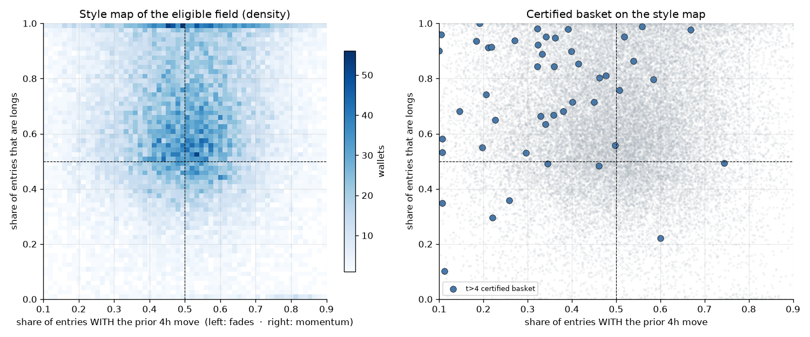

*The provable edge on this venue is mostly dip-buying: entering against short-term moves
and collecting the drift afterward.*

**Maker-heavy wallets carry more information, not less.** We initially filtered them out;
testing the filter showed the opposite of what we assumed — next-month performance rises
with maker share:

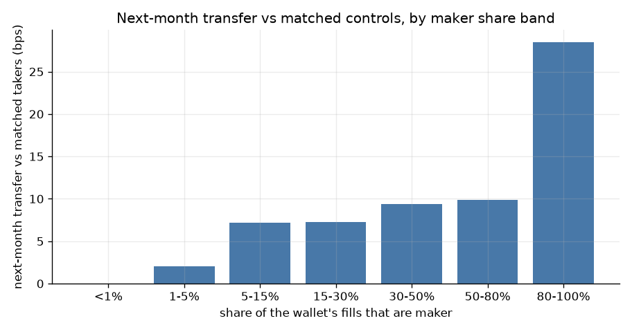

*When a wallet that usually posts resting orders pays the spread instead, that entry means
something.*

**Alt records identify skill; majors records mostly don't.** Ranking wallets by their
alt-coin performance predicted even their majors trading in our fold tests (z ≈ +1.1,
exploratory); ranking by majors performance predicted nothing:

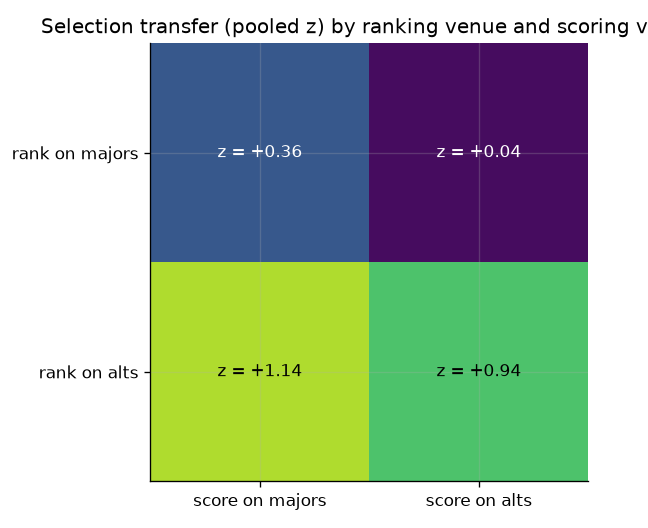

*Majors PnL is mostly shared market direction, so it hides skill. Alt picks are individual
decisions, so skill shows. The certified list still includes majors traders — 7 of the 47
profiled are >80% majors — because the certification pools all of a wallet's evidence.*

## 7. Limitations

- Maker fills were captured but never scored — the passive side of the tape is unexamined.
- Traders who act rarely (only during dislocations) fail the activity filters and are
  invisible to this analysis.
- Position reductions are not scored as decisions; selling before a drop is information we
  ignore.
- Delisted coins stop producing prices, so their final losses drop out of scoring; this
  flatters alt results.
- The certified list was assembled on all 11 months. Its out-of-sample test is July.
- Horizons of 2h and below carry ~5min pricing noise from 5-minute bars.

---

*Companion materials: `hyperliquid_trader_composition.ipynb` (all horizons, all tables),
`CAMPAIGN_LOG.md` (every method tried and why the failed ones failed),
`badge_v2_basket.json` (the certified list with entity groups). Every figure regenerates
from `report2_figs.py`; every number traces to a pipeline artifact.*
